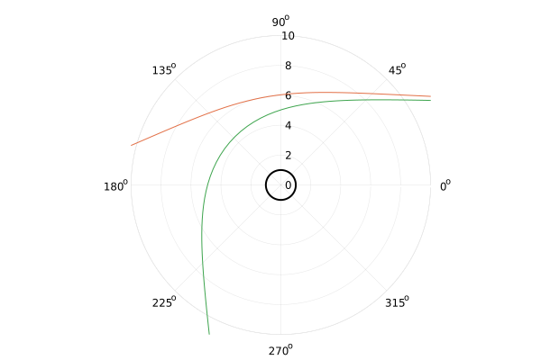

@def title = "Geodesic solutions from a symbolic metric with Julia"
@def summary = "A recent interest of mine has been integrating geodesic equations using DifferentialEquations.jl, for which I've been developing a small package. One of the aims of the project is to provide a symbolic backend for generating the needed Julia functions, and automatically integrating to trace geodesic paths in arbitrary metrics."
@def date = Date(2021, 11, 5)
@def tags = ["2021", "geodesics", "julia", "relativity"]

# Geodesic solutions from a symbolic metric with Julia

The Julia programming language has a very rich and complete differential equation solving library, courtesy of [SciML](http://sciml.ai), implementing a very diverse [number of solvers](https://diffeq.sciml.ai/stable/solvers/ode_solve/), ideal for many different mathematical applications.

The geodesic equation is an equation in the field of differential geometry that requires integrating, and describes the shortest path between two points on arbitrarily curved spaces. For some point $x$ on a manifold $\mathcal{M}$, the geodesic equation is

\begin{equation}
\label{eq-geodesic}
\deriv{^2 x^i}{\lambda^2}
    = - \tensor{\Gamma}{i}{jk} \deriv{x^j}{\lambda} \deriv{x^k}{\lambda},
\end{equation}

where $\tensor{\Gamma}{i}{jk}$ are the Christoffel symbols, and $\lambda$ is an affine parameter.

Calculating the components of this equation is, in general, an academic labour of love, which can be delegated to *computer algebra systems* (CAS), such as SageMath.

Julia has a maturing computer algebra system of its own, in the form of [Symbolics.jl](https://github.com/JuliaSymbolics/Symbolics.jl), originally developed for uses in simplifying dynamical system modelling in SciML. By building on the abstract type hierarchy of Julia, Symbolics.jl is more feature rich than the documentation might initially suggest -- allowing use of e.g. the linear algebra package with symbolic expression. The developers have instead focused on converting symbolic expressions into useable, parallelizable Julia functions. For an example of how powerful this can be, see [call stack tracing for auto-parallelization](https://symbolics.juliasymbolics.org/dev/tutorials/auto_parallel/).

With the intention of integrating eq. \eqref{eq-geodesic} for an arbitrary manifold given only the symbolic metric, we hope to explore whether Julia's emergent features are capable enough to already support symbolic tensor algebra, by integrating and visualizing null-geodesics in the Eddington-Finkelstein coordinates.

## Symbolic tensors and contractions

As good of a place to start as any is with writing tensor equations in Julia; the difficulty here is the way in which index contractions are expressed. Fortunately, Julia has numerous Einsum implementations, such as [Tullio.jl](https://github.com/mcabbott/Tullio.jl), which allows for very expressive code.

For example, consider the vector dot product

\begin{equation}
\label{eq-u-dot-u}
    u \cdot u = \tensor{g}{}{ij} u^i u^j,
\end{equation}

where $\tensor{g}{}{ij}$ is the metric.

We can express a symbolic vector and metric (matrix), and Tullio provides the contraction abstraction for us:

```julia
using Symbolics, Tullio

@variables u[1:4] g[1:4, 1:4]
@tullio out := g[i, j] * u[i] * u[j]
```

Combining this with something like [Latexify.jl](https://github.com/korsbo/Latexify.jl) for the output already provides most of the necessary tools to begin tensor symbolics.

For raising and lowering indices, both the metric and the inverse metric are required. For sufficiently small dimensions, we may use Julia matrices to represent the metric:
```julia
@variables M, t, r, θ, ϕ

g = zeros(Num, (4, 4))

# Eddington-Finkelstein metric
g[1, 1] = -(1 - 2 * M / r)
g[2, 2] = 1 + 2 * M / r
g[3, 3] = r^2
g[4, 4] = (r * sin(θ))^2

# off-diagonal
g[1, 2] = 2 * M / r
g[2, 1] = g[1, 2]
```

and calculate the inverse using the linear algebra package `inv`:

```julia
using LinearAlgebra

ginv = inv(g)
```

### Christoffel symbols

With Tullio, expressing tensor equations is very natural. The symmetrized Christoffel symbols are

\begin{equation}
    \tensor{\Gamma}{i}{jk}
    = 
    \frac{1}{2} \tensor{g}{im}{} \left(
        \pderiv{\tensor{g}{}{mj}}{x^k}
        +
        \pderiv{\tensor{g}{}{mk}}{x^j}
        -
        \pderiv{\tensor{g}{}{jk}}{x^m}
    \right),
\end{equation}

or, using Tullio

```julia
δ = map(Differential, [t, r, θ, ϕ])

@tullio Γ[i, j, k] := 1 / 2 * ginv[i, m] * (
        expand_derivatives(
            δ[k](g[m, j]) + δ[j](g[m, k]) - δ[m](g[j, k])
        )
    )
```

Apart from the call to `expand_derivatives` (which could also be broadcast later), the code we write in Julia is intuitive and almost identical to the mathematical form. 

### Geodesic equation

Expressing eq. \eqref{eq-geodesic} with Tullio is also extremely simple:

```julia
@variables v[1:4] # velocity vector
@tullio δ²xδλ²[i] := -Γ[i, j, k] * v[j] * v[k]
```

We've now assembled the full geodesic equation symbolically, in pure Julia, in just a handful of lines of code!

To wrap this all into a function:
```julia
function geodesic_eqs(g, v, δ)
    ginv = inv(g)
    @tullio Γ[i, j, k] :=
        1 / 2 * ginv[i, m] * (
            expand_derivatives(
                δ[k](g[m, j]) + δ[j](g[m, k]) - δ[m](g[j, k])
            )
        )
    @tullio δ²xδλ²[i] := -Γ[i, j, k] * v[j] * v[k]
    simplify.(δ²xδλ²)
end
```
where we broadcast `simplify` in the last line of the function in an attempt (and hope) to reduce complexity.

### Limitations

Symbolics.jl is still a maturing library, and cannot simplify or expand equations as effectively as veteran toolkits like SageMath. Likewise, the `solve_for` function in Symbolics.jl is currently limited to only linear equations, which quickly becomes problematic in non-linear coordinates. 

In the above case of the Eddington-Finkelstein metric, the expressions produced with Julia are considerably more complex that those produced with SageMath. These differences are even more drastic when examining more involved metrics, such as Kerr-Newman in Boyer-Lindquist coordinates. If obtaining simplified equations is the desire, it is unsurprising SageMath is the better tool, but it is impressive how much Julia is already able to accomplish in this domain. Furthermore, as one might expect, Julia remains orders of magnitude faster!

## Integrating the geodesic equation

Using Symbolics.jl's `build_function`, we can use `geodesic_eqs` to construct a Julia function that we can wrap and pass an integration problem to DifferentialEquations.jl. An implementation of this may look like:

```julia
function build_ode(g, coords, v, args)
    δ = map(Differential, coords)
    geod = geodesic_eqs(g, v, δ)
    build_function(geod, [coords...], v, args...)
end
```

which is used
```julia
func = build_ode(g, [t, r, θ, ϕ], v, [M])
```

Note that `build_function`, and therefore `build_ode`, return two functional variants -- one with in-place and one with an out-of-place signature. Anticipating the performance improvement of [StaticArrays.jl](https://github.com/JuliaArrays/StaticArrays.jl), we will use the out-of-place variant:

```julia
using DifferentialEquations, StaticArrays

geo_func = eval(func[1]) # use out-of-place

function intprob(u, p, λ)
    x = @view(u[1:4])
    v = @view(u[5:8])
    du = geo_func(x, v, 1.0) # fixed mass example
    SVector(v..., du...)
end

u0 = SVector(
    0.0, 200.0, π / 2.0, 0.0, # initial position 4-vector
    normalize([0.0, -1.0, 0.0, 1.5e-4])... # initial velocity 4-vector
)

prob = ODEProblem{false}(intprob, u0, (0.0, 500.0), nothing)
sol = solve(prob, Tsit5())
```

We can visualize the solution with basic polar plotting:

```julia
using Plots

pl = plot(
    _ -> 1.0, # event horizon radius
    0:0.01:2π,
    lw = 2,
    legend = false,
    proj = :polar,
    color = :black,
    range=(0.0, 10.0) # limit the view close to the origin
)

# plot solution
plot!(sol, vars=(4, 2))
```


We must now attempt to restrict the type of geodesic we are calculating.

Recall that three domains exist depending on the value of eq. \eqref{eq-u-dot-u}, with null geodesics having $u \cdot u = 0$. The initial velocity vector must be constrained by the $v_t$ component to satisfy this condition in order for the solution to be light-like (i.e. a photon path). A simple way of achieving this is to calculate

\begin{equation}

\tensor{g}{}{ij} v^i v^j = 0,

\end{equation}

for an initial velocity vector $v$, using the numerical value of the metric at the initial position $u$, to find an initial value of $v_t$ which keeps the geodesic light-like.

The expression to solve is straight forward to generate. In the case where we only change the initial velocity angles $\theta$, $\phi$, we can simplify the problem a little

```julia
# dummy velocity components
@variables vt0, vθ, vϕ

vel_vec = [vt0, -1.0, vθ, vϕ]
@tullio out := g[i, j] * vel_vec[i] * vel_vec[j]
```

solving

```julia
out ~ 0
```

The equation we assemble and store in `out` is

\begin{equation}
\label{eq-vt-out}
1 + \frac{2 M}{r} + v_\theta^{2} r^{2} + v_t^{2} \left(\frac{2 M}{r} - 1 \right) - \frac{ 4 M v_t}{r} + \sin^{2}\left( \theta \right) v_\phi^{2} r^{2} = 0,
\end{equation}

which we would want to solve for $v_t$.

We now encounter the current limitations of Symbolics.jl, namely the lack on non-linear symbolic solvers leaving us no simple way to rearrange the symbolic expression for $v_t$. Here, however, [NLsolve.jl](https://github.com/JuliaNLSolvers/NLsolve.jl) will be able to approximate a numerical solution. This involves building a function from our symbolic expression, and exposing only $v_t$ as an argument for which to find the roots of eq. \eqref{eq-vt-out}. 

We build the function with

```julia
con_func_sym = build_function(
    out,
    vt0, vθ, vϕ,    # velocity components
    [t, r, θ, ϕ],   # initial position for calculating metric
    M               # additional argument
)

con_func = eval(con_func_sym)
```

In order to use this with NLsolve, we wrap the function as the optimization target

```julia
function optimf!(F, x)
    F[1] = con_func(x[1], u0[7], u0[8], @view(u[1:4]), 1.0)
end
```

and could choose to compute the Jacobian symbolically for a better (and faster) result. For brevity, I will leave this out, and simply use

```julia
nsol = nlsolve(optimf!, [1.0])
```

Note that eq. \eqref{eq-vt-out} has two solutions for $v_t$, representing the forward and backward direction of time. In our case, we are examining a stationary metric, and thus the solutions are equivalent -- but we can push the solver to find one solution over another by tweaking the initial value, as above, to start in the positive domain.

With $v_t$ constrained, we reassemble `u0` and integrate again:

```julia
u0 = SVector(
    u0[1:4]...,
    normalize([nsol.zero[1], u0[6:8]...])...
)

prob = ODEProblem{false}(intprob, u0, (0.0, 500.0), nothing)

sol = solve(prob, Tsit5())
```

Plotting the solution of the null geodesic in this metric:



Although this numerically driven approach works, the equations Symbolics.jl simplifies are still complex, and will posit a performance overhead that can become problematic. Furthermore, the use of numerical algorithms where analytic solutions are known, as in the case of constraining the velocity for a null geodesic, will scale poorly for many geodesics. Calls to SymPy may be made to aid in the symbolic processes to alleviate this, but then the novelty of the pure Julia implementation is lost; instead, I believe patience and the steady development of Symbolics.jl will eventually permit such a feat.

Until then, we may explore a SageMath-Julia hybrid method which leverages the best of both languages, to generate fast and simpler symbolic expressions.

## A SageMath-Julia workflow

The recipe is a well known and simple one:

1. Compute the geodesic equation symbolically in SageMath, with use of SageManifold, in a simplified form.
2. Determine a symbolic solution to the null-geodesic constraint problem, expressing $v_t$ as a function of the other parameters.
3. Export these equations as string expressions, to then copy as Julia code.

The SageMath script involved is simple:
```python
import itertools
# helper function for iterating indices
def indexprod(n):
    return itertools.product(*[KM.irange() for _ in range(n)])

# define a manifold
KM = Manifold(4, 'M', latex_name=r'\mathcal{M}', start_index=0)  
chart.<t,r,theta,phi> = KM.chart()

# mass symbol
M = var('M')
# velocity component symbols
vt, vr, vtheta, vphi = var("v_t, v_r, v_theta, v_phi")

# metric
g = KM.lorentzian_metric('g')
g[0,0] = -(1 - 2*m/r)
g[0,1] = 2*m/r
g[1,1] = 1 + 2*m/r
g[2,2] = r^2
g[3,3] = (r*sin(theta))^2

# compute Christoffel
cs = g.christoffel_symbols()

# assemble geodesic equation components
geodesic_equation = [0, 0, 0, 0]
vel = [vt, vr, vtheta, vphi]
for (i, j, k) in indexprod(3):
    geodesic_equation[i] += - cs[i, j, k] * vel[j] * vel[k]

# assemble constraint equation
constraint_equation = 0
ginv = g.inverse()
for (i, j) in indexprod(2):
    constraint_equation += g[i,j] * vel[i] * vel[j]
```

The constraint equation we generate here is

\begin{equation}
\frac{r^{3} v_{\phi}^{2} \sin\left({\theta}\right)^{2} + r^{3} v_{\theta}^{2} + {\left(2 \, m + r\right)} v_{r}^{2} + 4 \, m v_{r} v_{t} + {\left(2 \, m - r\right)} v_{t}^{2}}{r} = 0,
\end{equation}

c.f. eq. \eqref{eq-vt-out} with $v_r = -1$, which we can ask SageMath to solve symbolically:

```python
vt_sols = (constraint_equation.expr() == 0).solve(vt)
```

to obtain:

\begin{equation}
v_{t} 
    = \frac{-2 \, m v_{r} \pm \sqrt{-{\left(2 \, m r - r^{2}\right)} v_{\phi}^{2} \sin\left({\theta}\right)^{2} - {\left(2 \, m r - r^{2}\right)} v_{\theta}^{2} + v_{r}^{2}} r}{2 \, m - r}, \\
\end{equation}

which is much more convenient to work with.

It is now trivial to export this equation, along with the geodesic components, as plain string expressions and paste them as Julia code in the REPL. For more complex metrics, the generated expressions are repulsively long, and require some caching to be performant, which Julia is not able to automatically do (e.g., evaluate $\sin(\theta)$ once per call, and reuse the same value throughout the function body). Luckily, with modern text editors, a string-search-replace is a rapid way to mimic this.

## Remarks

The pure Julia symbolic approach for geodesic equations will be implemented in [DiffGeoSymbolics.jl](https://github.com/astro-group-bristol/DiffGeoSymbolics.jl), and a SageMath abstraction is already implemented in [ComputedGeodesicEquations.jl](https://github.com/astro-group-bristol/ComputedGeodesicEquations.jl). This is all part of a black hole simulating ecosystem I am developing as part of my PhD, hosted on the Astrophysics Group Bristol GitHub organization.