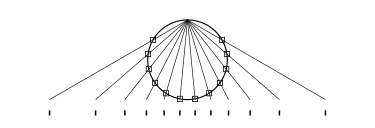
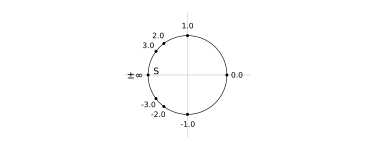
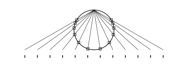
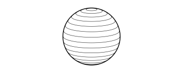
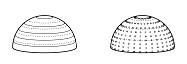
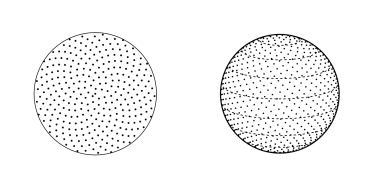
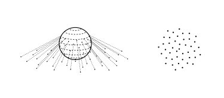

@def title = "Uniform projections of spherical distributions"
@def summary = "Motivated by a lamp post, I want to find some projection of points on a sphere, which ensures that their shadow is uniformly and equidistantly distributed. Moreover, I want these points to be parameterized by a single real value, such that I can easily generate these distributions in software projects."
@def date = Date(2022, 04, 14)
@def tags = ["2022", "mathematics", "julia", "projections"]

# Uniform projections of spherical distributions

Imagine a light source above a plane of photosensitive paper that emits light into any given direction, such that every time it emits a ray of light, a single point on the paper lights up. In two dimensions, if each direction has equal probability of being chosen, we might picture something like this:



Here, the angle between any two rays is the same. Notice that the majority of the points lit up on the paper are directly beneath the light source, and few further away.

Now imagine we can control the angle $\theta$ at which the source emits light. What if we wanted the distribution of points on the paper to be uniformly spaced? How should we pick $\theta$? What probability distribution of $P(\theta)$ do we sample $\theta$ from? What if we considered the full two dimensional plane, how would we pick $\theta$ and $\phi$ together?

The aim of this blog post is to calculate angular distributions that create uniform projections on a plane, and learn some useful tricks along the way.

## Stereographic projections

We'll start by picturing a one dimensional plane, i.e. a line, representing our photosensitive paper as in the above figure. For a ray at a given angle $\theta$, the point of intersection on the plane is calculated by considering the equation of a straight line -- we position our light source at $x=0$ and $y = 1$ without loss of generality, with the gradient of each ray being $-\tan (\theta)$, and find a given ray intercepts $y=0$ at

\begin{equation}
    \label{eq:solve_m}
    0 = -\tan(\theta)\, x + 1 \quad \implies \quad x = \frac{1}{\tan(\theta)} = \cot (\theta).
\end{equation}

We'll express this for convenience as the action of the projection $\mathcal{P} : \mathbb{R} \rightarrow \mathbb{R}$, projecting an angle $\theta$ to a point $x$, which is a [_stereographic projection_](https://en.wikipedia.org/wiki/Stereographic_projection) of the $1$-Sphere onto the reals.

The inversion of this map, $\mathcal{P}^{-1}$, takes some point $t$ on $\mathbb{R}$ and gives us the angle $\theta$ that a ray would need to intersect $y=0$ at $t$. Though $\mathcal{P}^{-1}$ is already obvious, we'll make a quick detour to discuss, what Michael Spivak calls, the [_sneakiest substitution_](https://en.wikipedia.org/wiki/Weierstrass_substitution) in the world:


@@theorem
**Weierstrass substitution:**

Let $t = \tan \left( \frac{\theta}{2} \right)$, then

\begin{equation}
\sin \left( \frac{\theta}{2} \right) = \frac{t}{1+t^2}, 
    \quad \text{and} \quad 
\cos \left( \frac{\theta}{2} \right) = \frac{1}{1+t^2},
\end{equation}

with $\theta \in \left( -\pi, \pi \right)$, and hence

\begin{equation}
\sin \left( \theta \right) = \frac{2t}{1+t^2}, 
    \quad \text{and} \quad 
\cos \left( \theta \right) = \frac{1-t^2}{1+t^2}.
\end{equation}
@@

These formulae are trivial to derive; the genius is the definition of $t$. This substitution is used frequently in integral calculus to simplify trigonometric integrations, but it also sees use in stereographic projections. The Weierstrass substitution parametrizes the whole unit circle minus the point $S = (-1, 0)$, which is approached as $t \rightarrow \pm \infty$. Examining some values of $t$ and their corresponding point on the unit circle:



The points are initially spaced out angularly, and then asymptotically approach $S$ as $t$ becomes very large in magnitude.

To make use of this in our case, we want to move the unit circle to be centered on $x=0$ and $y= \frac{1}{2}$, and re-orient the parameterization such that $S$ is orientated on the $y$ axis (i.e. flip the $x$ and $y$ components). In this manner, $t=0$ corresponds to a light ray traveling perpendicular to the paper, and increasing magnitudes of $t$ project points further afield. Our modified _Weierstrass projection_, which we'll denote $\mathcal{W}$, is

\begin{equation}
    \label{eq:weier_param}
    t \mapsto (x, y) = \left( \frac{t}{1 + t^2}, \ \frac{-1}{1 + t^2} + 1 \right).
\end{equation}

Note that the point $(x, y)$ will always lie on our circle; we have here a stereographic projection from $\mathbb{R}$ to a point on the $1$-Sphere.

Similarly to eq. \eqref{eq:solve_m}, we'll solve for the gradient of the ray intersecting $(0, 1)$ and a point given by eq. \eqref{eq:weier_param}, namely

\begin{equation}
    \frac{-1}{1 + t^2} = m \left( \frac{t}{1 + t^2} \right) + 1,
\end{equation}

and therefore, we may identify

\begin{equation}
    m = \frac{1}{t} \implies \theta = \arctan\left( \frac{1}{t} \right).
\end{equation}


Which is precisely $\mathcal{P}^{-1}$. If $t$ is uniformly distributed, the set of angles we may calculate will ensure the projections are uniform as well (in this case trivially, since the $t$ are also the points of intersection). What we have practically done is calculate where the projected points lie, inverted the map, and found the angle which would intersect at the given point -- and since we're working in the two dimensional case, we can use this as a parametrization. 

### Visualizing the Weierstrass projection

Implementing the key maps we have so far:

```julia
𝒲(t) = t / (1 + t^2), -1 / (1 + t^2) + 1
𝒫(θ) = cot(θ)
𝒫_inv(t) = atan(1/t)
```

For any point of intersection $t$ we can calculate the intersection with our circle with $\mathcal{W}$, and the angle of that ray with $\mathcal{P}^{-1}$. We'll uniformly distribute $t$:

```julia
# go from -60 degrees to 60 degrees
ts = range(-tan(π/3), tan(π/3), 12)
θs = 𝒫_inv.(ts)
points = 𝒲.(ts)
```

Plotting these points:



Shown here, as in the first figure, are the light rays emitted by the light source, the intersection with the plane (denoted by the thick ticks beneath the rays), and the intersections with the projecting $1$-Sphere, shown as boxes. Now let's consider the $2$-Sphere and points on a two dimensional plane.

## Useful concepts and maps 

Before we examine the three dimensional setup, there are a few things that are useful to cover:
- the Jacobian in the context of distributions,
- parameterizing non-uniform distributions, and
- methods for generating uniform points on spheres.

We'll define our coordinate transformation from Cartesian to spherical polar as

\begin{equation}
    \left(
        \begin{matrix}
            x\\
            y\\
            z\\
        \end{matrix}
    \right)
    =
    \left(
        \begin{matrix}
            r \sin(\theta) \cos (\phi)\\
            r \sin(\theta) \sin (\phi)\\
            r \cos(\theta)\\
        \end{matrix}
    \right),
\end{equation}

with $\theta$ being the elevation angle, and $\phi$ the azimuthal angle, following the convention that $\theta = 0$ corresponds to the positive $z$ axis, and $\phi = 0$ is the positive $x$ axis. 

As an aside, a temptation for generating random points on the surface of the sphere is to sample $\theta$ and $\phi$ from uniform distributions between $\left[0, \pi \right]$ and $\left[0, 2 \pi \right)$ respectively, however, such a sampling generates the majority of the points close to the poles. We already know, from studying the two dimensional case, that this will not provide us with a uniform projection, but it is still worth using as a comparison. The intuition for this is picturing circles of constant and equally spaced $\theta$ on the surface of the sphere:



If we draw $N$ points on each ring, as a uniform distribution would, there would be a higher point density where the rings are smaller. We would require a measure that preserves the point density on the sphere -- and fortunately the Jacobian tells us exactly what such a distribution would look like.

### The Jacobian and distributions

For geometric purposes, the _Jacobian matrix_ describes how each coordinate in the new coordinate system changes with respect to each coordinate in the old coordinate system. It is a matrix $\mathbf{J}$ where each matrix element is the partial derivative

\begin{equation}
    \mathbf{J}_{ij} = \pderiv{y_i}{x_j},
\end{equation}

where $y_i$ are the new coordinates, and $x_j$ are the old coordinates. The Jacobian tells us how lengths change under transformation at any point, and the determinant of the Jacobian tells us how area and volume elements transform,

\begin{equation}
    \d y_1 \d y_2 \cdots \d y_n = \det \left[ \mathbf{J}(x_1, x_2, \ldots, x_m) \right] \d x_1 \d x_2 \cdots \d x_m .
\end{equation}

As point density is merely the number of points per unit volume, the determinant of the Jacobian _also_ tells us the shape of distributions that preserve point density, as it tells us how we may preserve volumes. For the case of our spherical coordinates, where we have fixed the radius to $r=1$, this is

\begin{equation}
    \label{eq:jac_sphere}
    \det \left[ \mathbf{J} \left( r, \theta, \phi \right) \right]
    = \left\lvert
        \begin{matrix}
            \pderiv{x}{r} & \pderiv{x}{\theta} & \pderiv{x}{\phi} \\
            \pderiv{y}{r} & \pderiv{y}{\theta} & \pderiv{y}{\phi} \\
            \pderiv{z}{r} & \pderiv{z}{\theta} & \pderiv{z}{\phi} \\
        \end{matrix}
    \right\rvert_{r=1}
    = \sin (\theta),
\end{equation}

and therefore, if we sample $\theta$ from a $\sin$ distribution, we will have uniform points on a sphere. But how do we generate non-uniform distributions such as $\sin$?


### Parameterising non-uniform distributions

For some random uniformly sampled $x_\text{in} \sim \mathcal{U}(0, 1)$, and a desired distribution $P(\theta)$ with $\theta \in \left[\theta_1, \theta_2\right)$, suppose we want to use $x_\text{in}$ to generate a $\theta_\text{out}$ which is distributed according to $P(\theta)$. In other words, we want the _cumulative density functions_ (CDF) of the two to be equal

\begin{equation}
\int_{0}^{x_\text{in}} \d x = \int_{\theta_1}^{\theta_\text{out}} P(\theta) \d \theta,
\end{equation}

such that when $x_\text{in} = 1$ and $\theta_\text{out} = \theta_2$, these integrals equate to unity (in practice, this often requires a normalization factor for $P(\theta)$). The LHS is trivial, and allows us to make good use the _inverse CDF method_, or [Smirnov transform](https://en.wikipedia.org/wiki/Inverse_transform_sampling):

@@theorem
**Smirnov transform:**

Let $Q : \mathbb{R} \rightarrow \mathbb{R}$ be invertible, which maps $\theta_\text{out} \mapsto Q(\theta_\text{out}) = x_\text{in}$ with $x_\text{in} \sim \mathcal{U}(0,1)$, and $P(\theta)$ be a normalized distribution. Defining the forward action

\begin{equation}
\label{eq:smirnov}
Q(\theta_\text{out}) := \int_{\theta_1}^{\theta_\text{out}} P(\theta) \d \theta,
\end{equation}

implies the reverse $\theta_\text{out} = Q^{-1}(x_\text{in})$ yields some $\theta_\text{out} \sim P(\theta)$ from $x_\text{in}$.
@@

The key observation that makes all of this useful is that for large $N$, our random $x_\text{in}$ is uniform, and therefore these probabilistic results may _also_ be used for general uniform input.

We can use this to generate points under a $\sin \theta$ distribution (c.f. eq. \eqref{eq:jac_sphere}); we restrict $\theta \in \left[0, \pi \right)$ and then define $ P(\theta) = \frac{1}{2} \sin \theta$ such that it is normalized. Then

\begin{equation}
x_\text{in} = \frac{1}{2} \int_0^{\theta_\text{out}} \sin \theta \d \theta = \frac{1}{2} \left( 1 - \cos \theta_\text{out} \right),
\end{equation}

and therefore 
\begin{equation}
\label{eq:sin_theta}
Q^{-1}(x) = \arccos\left( 1 - 2x \right).
\end{equation}

Note that to change the domain of $\theta$, we change the normalization factor $A$ in $P(\theta)$, which propagates to $\arccos \left(1 - \frac{x}{A} \right)$. From some uniform $x$, we now have a method of generating uniform points on a sphere. Expressing this as a couple of Julia functions, we use our $Q^{-1}$ and then transform our angles to Cartesian coordinates:
```julia
# returns θ, ϕ
angles_on_sphere(x1, x2) = (acos(1 - 2x1), 2π * x2)
# spherical to cartesian
spher_to_cart(r, θ, ϕ) = (r * sin(θ) * cos(ϕ), r * sin(θ) * sin(ϕ), r * cos(θ))

function point_on_sphere(x1, x2; R = 1.0)
    θ, ϕ = angles_on_sphere(x1, x2)
    spher_to_cart(R, θ, ϕ)
end
```

Note that `x1 == x2` is ideal, however for illustrative purpose I have decoupled these inputs so we can draw more azimuthal points per ring. We use these functions to map rings onto the sphere
```julia
# six rings, only go to 0.5 for upper hemisphere
x1_range = range(1-cos(π/12), 0.5, 6)

# fine range to ensure good resolution 
# using the adjoint to broadcast with tensor products
x2_range = adjoint(0.0:0.01:1)

rings = point_on_sphere.(x1_range, x2_range)
```

Visualizing these rings on the upper hemisphere:



*Left panel*: the dashed lines are when $\theta$ is equidistant, to contrast how the spacing changes; we see the difference between the rings is initial much greater, and converges with the equidistant lines the by the time we reach the equator. *Right panel*: the $\sin$ distribution with $\theta$ and $\phi$ generating points on the upper hemisphere. 

This is great and all, as for large samples the point density across the surface is constant, but there's still a problem -- the method for generating $\phi$ gives the same angles for each ring, resulting in slices down the great circle, like the pieces of an orange. We ideally desire some mechanism for generating a sprinkling of points on the surface of the $2$-Sphere, which we can later use to test our projections.

### Golden spirals

The _golden spirals_ method generates discrete uniform points in polar coordinates. It works by placing a point, rotating by the [golden ratio](https://en.wikipedia.org/wiki/Golden_ratio) and moving outwards a little, then placing another point and repeating. This ensures no two points are ever directly intersected by the same line through the origin. 

In other words, let $t \in \mathbb{R}^+$ be positive, then the angles are generated by

\begin{equation}
    \phi = t \, \pi \left( 1 + \sqrt{5} \right) .
\end{equation}

We want the number of points in an annulus $r$ to $r + \d r$ to be proportional to the area to engender constant point density, where the area element (derived from the Jacobian in two dimensions) is

\begin{equation}
    \d A = \int_0^{2\pi} r \d r \d \theta = 2 \pi \d r.
\end{equation}

Using the Smirnov transform from eq. \eqref{eq:smirnov}, we calculate a distribution for $r \in \left[ 0, 1 \right]$, setting the normalized area distribution $P(r) = 2 r$. Consequently we find

\begin{equation}
    Q(r) = r^2,
\end{equation}

and therefore

\begin{equation}
    Q^{-1}(t) = \sqrt{t}.
\end{equation}

The full action of the golden spiral map may now be be expressed:

@@theorem
**Golden spiral map:**

The _golden spiral map_ creates uniform polar points within the unit circle, and is denoted $\mathcal{G} : \mathbb{R}^+ \rightarrow \mathbb{R}^2$. It maps

\begin{equation}
    \label{eq:golden_spiral}
    t \mapsto (r, \phi) = \left( \sqrt{\frac{t}{t_\text{max}}},\ t\, \pi\left( 1 + \sqrt{5} \right) \right),
\end{equation}

for $t \in \mathbb{R}^+$.
@@

The division by $t_\text{max}$ ensures that radial distribution is fixed between $0$ and $1$, i.e. the unit circle. In code:
```julia
golden_spiral(t, tmax) = [√(t/tmax), (t * π)*(1 + √5)]

# generate 300 points
ts = 0:300
points = map(t -> golden_spiral(t, last(ts)), ts)
```

This can be generalized to a sphere by calculated $\phi$ via the golden spiral map, and $\theta$ via the $\sin$ distribution in eq. \eqref{eq:sin_theta}. Plotting these:



*Left panel*: plot of the 300 generated points in polar coordinates, with a bounding unit circle. If you look closely, you can see how the spiral paths seem to appear in the distribution. *Right panel*: using the golden spiral method to generate $\phi$ for our uniform distribution of spherical coordinates. 

This looks perfectly and equally even! However, its projections unfortunately won't be:


This suffers from the same pathologies as equidistant angles in the two dimensional case.


## Uniform $2$-Sphere projections

For the $2$-sphere, we now consider $\mathcal{P}$ as projecting some $\theta$ and $\phi$ onto the $x$-$y$ plane, which we may derive through simple geometry:

\begin{equation}
    \label{eq:xy_proj}
    (\theta, \phi) \mapsto (x, y) 
        = \left( 
            \cot\left(\frac{\theta}{2}\right) \cos(\phi), \cot\left(\frac{\theta}{2}\right) \sin(\phi)
        \right).
\end{equation}

The normalizing factor $\frac{1}{2}$ is to ensure we cover the full range of $\cot$. For the golden spiral projection eq. \eqref{eq:golden_spiral}, we desire

\begin{equation}
    (x, y) 
        = \left( 
            \sqrt{\frac{t}{t_\text{max}}} \cos (\phi), \sqrt{\frac{t}{t_\text{max}}} \sin (\phi)
        \right),
\end{equation}

and therefore $\cot(\frac{\theta}{2}) = \sqrt{t}$. Given our understanding so far, we can immediately infer, either using the Weierstrass projection, or simply by re-arranging eq. \eqref{eq:xy_proj}, that

\begin{equation}
    \label{eq:uniform-param}
    t \mapsto (\theta, \phi) =  \left( 
        2\arctan\left( \sqrt{\frac{t_\text{max}}{t}} \ \right), \
        t\, \pi \left( 1 + \sqrt{5} \right)
    \right),
\end{equation}

is a parameterization for generating uniform, equidistant projections, leveraging the golden spiral map and the Weierstrass substitution.

This map isn't quite $\mathcal{P}^{-1}$, since it does not map $x$, $y$ to $\theta$, $\phi$, but it _is_ precisely the map we want to be able to generate our projections. Well, almost -- if we analyze the limits of $t$, we find

\begin{equation}
    t = t_\text{max} \implies 
    \theta =
    2\arctan\left( 1 \right) = \frac{\pi}{2},
\end{equation}

limiting our projection to equator of our sphere, corresponding to a $45^\circ$ cone. However, this does have the practical benefit that we may scale the cone by simply dividing by a constant factor in the square root. Let's implement a possible version of this

```julia
angles_on_sphere(t; elevation_factor=1) = (
    2atan(√(t/elevation_factor)), (t * π)*(1 + √5)
)
```

This `elevation_factor` lets us now adjust the limits of our cone. As $t \rightarrow \infty$, we should be able to theoretically cover the whole of the $x$-$y$ plane in points. But for now, let's set the `elevation_factor` to `t_max / 3`and visualize a $60^\circ$ cone:




Perfect! With this, let's reconsider our initial light source above photosensitive paper.


## Discussion

The parameterization given in eq. \eqref{eq:uniform-param} allows us to take some uniformly distributed positive $t \in \mathbb{R}^+$, and calculate angles which would project uniformly onto the $x$-$y$ plane. The result is already quite interesting, but it's applications should hopefully prove fruitful:

The _lamp post model_ is a coronal model for accreting black holes, which consists of a super-luminous cloud of pure electrons above the spin axis of the black hole. Simulations of such a model rely on using a geodesic integrator to approximate $\mathcal{P}$, in this case mapping $(\theta, \phi) \mapsto (x^0, x^1, x^2, x^3)$, a 4-vector describing the point of intersection with the accretion disc. In our software, we sample some $N$ points this way, and then use a custom _Delaunay interpolation_ algorithm (there's a future blog post in how we devised this) to create a smooth field of 4-vectors over the disc.

Up until now, these models would evenly distribute angles across the entire sky of the corona, which resulted in the majority of the 4-vectors we end up with being close the the source, and extremely few towards the edges of the disc (c.f. eq. \eqref{eq:sin_theta}). This situation is not ideal, and required extremely large $N$ to rectify -- but now, with this method for uniform projections, we anticipate much better coverage. 

This not only optimizes the run-time of the method, but should allow our interpolations to more faithfully reconstruct the true underlying field.