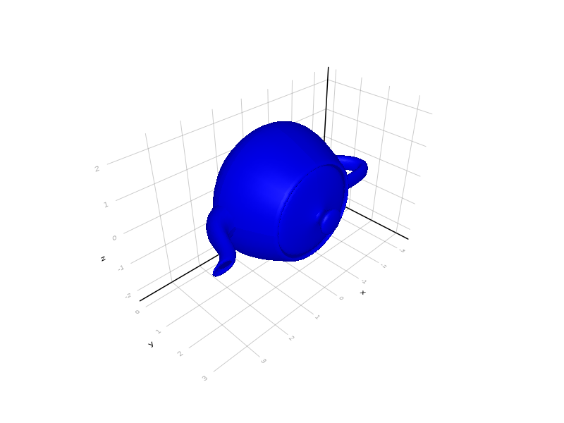
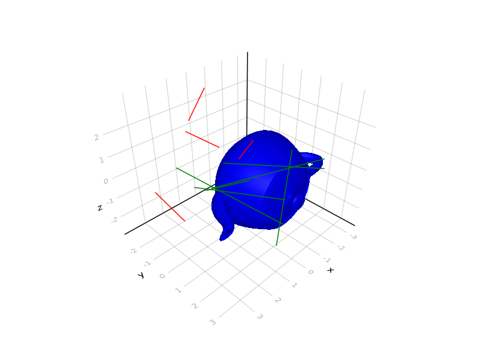
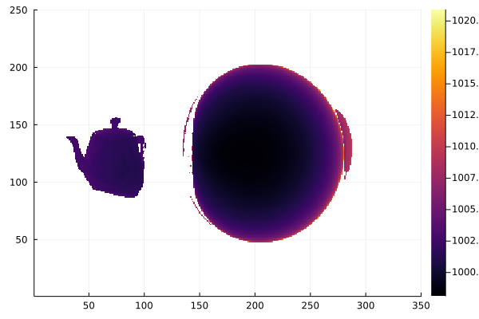
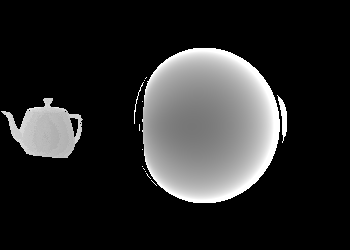

@def title = "Ray-tracing meshes in curved geometries"
@def summary = "For the past few months I've been working on ray-tracing algorithms for curved spacetimes, primarily for metrics describing black holes. I'm interested in later calculating light curves for arbitrary disc shapes, including those resulting from MHD simulations, so will explore including mesh files into the tracer."
@def date = Date(2022, 1, 13)
@def tags = ["2022", "ray-tracing", "julia", "relativity"]

# Ray-tracing meshes in curved geometries


I've recently refactored [some software](https://github.com/astro-group-bristol/GeodesicTracer.jl) I'm hoping to use to calculate reverberation lags around accreting black holes and X-ray binaries, which split up a monolithic project into more manageable packages. In specific, [AccretionGeometry.jl](https://github.com/astro-group-bristol/AccretionGeometry.jl) now handles all of the intersection calculations between geodesics and discs, but, also, _much more_. An intention has always been to later incorporate MHD simulations of accretion discs into the ray-tracer, to more accurately model light curves coming from accreting objects, which are commonly exported as some kind of mesh or grid. In the prior case, intersections between the mesh and traced geodesics need to be determined.

~~~
<h2>Overview</h2>
~~~
\tableofcontents

## Meshes and intersections

JuliaGeometry have [Meshes.jl](https://github.com/JuliaGeometry/Meshes.jl) for computational geometry and meshing algorithms, which exports a `has_intersect` function, returning `true` or `false` if one geometric object intersects with another. In practice, I was unable to get this to work with the `Segment` and `Mesh` type, so, instead, opted to try and implement my own algorithm. 

Mesh files (such as `.obj` files) define a series of vertices and the faces that connect them, effectively reducing some geometry into a collection of triangles. JuliaIO has the package [MeshIO.jl](https://github.com/JuliaIO/MeshIO.jl) for importing and exporting various mesh file formats into a standardized `GeometryBasics.Mesh` struct. Conventiently, this has a recipe for [Makie.jl](https://makie.juliaplots.org/stable/):

```julia
using FileIO
using CairoMakie, Makie

teapot = load("teapot.obj")

mesh(teapot, color=:blue)
```



Internally, these meshes are of type `Mesh{3, Float32, Triangle}`, effectively an array of `Triangle` primitives that can be iterated over.  For some line segment defined by the points $(Q_1, Q_2)$, we can determine whether an intersection with the mesh occurs by checking if the segment intersects with any of the triangles. We can start sketching this out in code:

```julia
function does_intersect(mesh::Mesh{3, T}, segment) where {T}
    for tri in mesh
        if intersects(tri, segment)
            return true
        end
    end
    false
end
```

The intersection between a segment and a triangle is a well studied problem: a brief search on the internet and you might stumble over ["A robust segment/triangle intersection algorithm for interference tests"](https://www.sciencedirect.com/science/article/pii/S0925772109001448) by Jiménez, Segura and Feito (2010), which details a few classic algorithms and introduces a novel approach, which I will attempt to detail.

### Jiménez, Segura and Feito (2010)

The authors derive their algorithm in [_barycentric_ coordinates](https://en.wikipedia.org/wiki/Barycentric_coordinate_system) -- effectively center of mass coordinates for $\mathbb{R}^N$ with respect to some $N+1$ points. For regular three dimensions, these coordinates are given relative to the vertices of a tetrahedron formed by $ABCD$. The coordinates are parameterized by $\alpha, \beta, \gamma, \delta \in \mathbb{R},$ thus a point $P$ is given by

\begin{equation}
    (\alpha + \beta + \gamma + \delta) P =  \alpha A + \beta B + \gamma C + \delta D, 
\end{equation}

with the special property that multiplication by some non-zero $\lambda$ leaves $P$ unchanged. Consequently, barycentric coordinates are degenerate, and two sets may be equivalent $(\alpha : \beta : \gamma : \delta) = \lambda (\alpha\prime : \beta\prime : \gamma\prime : \delta\prime)$. Uniqueness of the coordinates is imposed through the requirement

\begin{equation}
    \alpha + \beta + \gamma + \delta = 1,
\end{equation}

lifting the degeneracy.

The signed, or orientated, volume of the tetrahedron formed by $ABCD$ is

\begin{equation}
    \lvert ABCD \rvert = \frac{1}{6} 
        \begin{vmatrix}
            A - D \\
            B - D \\
            C - D
        \end{vmatrix},
\end{equation}

where the rows of the matrix are elements of the subtraction. This formulation solves the barycentric coordinates uniquely via

\begin{align}
    \alpha =\,& \frac{\lvert PBCD \rvert}{\lvert ABCD \rvert}, & \beta =\,& \frac{\lvert PADC \rvert}{\lvert ABCD \rvert} 
&   \gamma =\,& \frac{\lvert PABD \rvert}{\lvert ABCD \rvert}, & \delta =\,& \frac{\lvert PACB \rvert}{\lvert ABCD \rvert}.
\end{align}

The primary benefit of this is that establishing the location of the point $P$ relative to the tetrahedron formed by $ABCD$ is very easy: consider $\alpha$, for which the supporting plane is $BCD$:
- $\alpha = 0$ implies $P$ is *in the plane* of $BCD$,
- $\alpha > 0$ implies $P$ is on the *same side* of $BCD$ as $A$,
- $\alpha < 0$ implies $P$ is on the *opposite side* of $BCD$ from $A$.

The same property is true for $\beta$ and $ADC$, $\gamma$ and $ABD$, and $\delta$ and $ACB$. With this, we may claim:

@@theorem
**Theorem 1:**

Let $V_1 V_2 V_3$ be a triangle, and $Q_1 Q_2$ a segment such that $Q_1$ is _not coplanar_ the the plane of $V1, V2, V3$. The segment $Q_1 Q_2$ intersects $V_1 V_2 V_3$ _if and only if_

\begin{align}
\sign \alpha \leq\, & 0, & \sign \beta \geq\,& 0, & \sign \gamma \geq\,& 0, & \sign \delta \geq\,& 0,
\end{align}

where $(\alpha : \beta : \gamma : \delta )$ are the barycentric coordinates of $Q_2$ with respect to the tetrahedron $Q_1 V_1 V_2 V_3$.
@@

The sketch of this proof follows by considering the region restrictions imposed by the inequalities; $\sign \alpha \leq 0$ states $Q_2$ must be on the opposite side of the triangle formed by $V_1 V_2 V_3$ from $Q_1$, and the other inequalities restrict $Q_2$ within the tetrahedron if the sides were projected to infinity.

The authors provide a full proof, and also an algorithm which I have taken the liberty of implementing in Julia:
```julia
# Jiménez, Segura, Feito. Computation Geometry 43 (2010) 474-492
function jsr_algorithm(V₁::T, V₂::T, V₃::T, Q₁::V, Q₂::V; ϵ = 1e-6) where {T,V}
    A = Q₁ .- V₃
    B = V₁ .- V₃
    C = V₂ .- V₃
    W₁ = B × C
    w = A ⋅ W₁
    if w > ϵ
        D = Q₂ .- V₃
        s = D ⋅ W₁
        s > ϵ && return false
        W₂ = A × D
        t = W₂ ⋅ C
        t < -ϵ && return false
        u = -W₂ ⋅ B
        u < -ϵ && return false
        w < s + t + u && return false
    elseif w < -ϵ
        return false
    else # w == 0
        D = Q₂ .- V₃
        s = D ⋅ W₁
        if s > ϵ
            return false
        elseif s < -ϵ
            W₂ = D × A
            t = W₂ ⋅ C
            t > ϵ && return false
            u = -W₂ ⋅ B
            u > ϵ && return false
            -s > t + u && return false
        else
            return false
        end
    end
    true
end
```

This algorithm has [back-face culling](https://en.wikipedia.org/wiki/Back-face_culling). 

As a side note, algorithms in Julia are _absolutely beautiful_. 

Note that the types of the triangle vertices and point vertices have been left generic under the restriction that they must be similar -- this technically isn't required, but I've left in because it has helped me catch some strange type conversion elsewhere in my code.

### Implementing mesh intersections

With the above algorithm, we can now write some trivial wrapper code, and begin calculating segment with mesh intersections. For simplicity, I'm going to treat any array of tuple of vectors as a segment, instead of using a geometry primitive:

```julia
function has_intersect(mesh, seg)
    for tri in mesh
        if jsr_algorithm(tri[1], tri[2], tri[3], seg[1], seg[2])
            # break early
            return true
        end
    end
    false
end
```

Then we'll write a utility method for generating random segments in a given range, and create a plotting function which colors the lines according to whether they intersect with the teapot:

```julia
function plot_segments(teapot, segments)
    mp = mesh(teapot, color=:blue)
    for s in segments
        lines!(
            mp.axis,
            [s[1] ; s[2]],
            color=has_intersect(teapot, s) ? :green : :red
        )
    end
    mp
end

# seed RNG for reproducible figures
import Random: seed!
seed!(2022)

randsegment(range) = Tuple(Tuple(rand(-range:0.1:range) for _ in 1:3) for _ in 1:2)
plot_segments(teapot, [rand_segment(3.0) for _ in 1:10])
```

Unfortunately Makie by default will draw lines behind meshes, so the figure isn't as illustrative as initially hoped, but it is somewhat convincing that the intersection algorithm is working.



Here the green lines intersect with the teapot, whereas the red lines do not. 

## Benchmarking

We'll benchmark a given collection of segments with BenchmarkTools.jl to see how performant the intersection algorithm is:
```julia
seed!(2022)
segments = [randsegment(3.0) for _ in 1:10_000]

function test(teapot, segments)
    for s in segments
        has_intersect(teapot, s)
    end
end

using BenchmarkTools
@btime test($teapot, $segments)
# 757.721 ms (0 allocations: 0 bytes)
```

This is already pretty good. The exact same performance is obtained if the segments are `Tuple{SVector{3, Float64},SVector{3, Float64}}`, using the `SVector` type from [StaticArrays.jl](https://github.com/JuliaArrays/StaticArrays.jl). We can also convert the mesh structure to use `SVector` for the triangles:

```julia
static_teapot = map(teapot) do triangle
    Tuple(SVector(p[1], p[2], p[3]) for p in triangle)
end

@btime bench($static_teapot, $segments)
# 578.608 ms (0 allocations: 0 bytes)
```

This yields a slight performance boost, which will make a significant difference when plugging this into the geodesic ray tracer.

## Meshes in curved geometries

The software I have been working on for tracing geodesics around arbitrary spacetimes has recently undergone a large refactor, which makes strapping something like mesh-intersections quite straight forward. In fact, I implemented meshes as a feature in [AccretionGeometry.jl](https://github.com/astro-group-bristol/AccretionGeometry.jl) before even writing this post.

These was done by pre-calculating a bounding box around the meshes, and converting the mesh structure into StaticArrays, just as above:
```julia
# snippet from AccretionGeometry/src/meshes.jl
struct MeshAccretionGeometry{T} <: AbstractAccretionGeometry{T}
    mesh::Vector{Tuple{SVector{3,T},SVector{3,T},SVector{3,T}}}
    x_extent::Tuple{T,T}
    y_extent::Tuple{T,T}
    z_extent::Tuple{T,T}
end

function MeshAccretionGeometry(mesh)
    static_mesh = map(mesh) do triangle
        Tuple(SVector(p[1], p[2], p[3]) for p in triangle)
    end
    MeshAccretionGeometry(static_mesh, bounding_box(mesh)...)
end
# ...
```

The bounding box is used to determine whether the segment (here called `line_element`) currently traced is close to the mesh geometry or not -- this way we can discriminate having to run the intersection algorithm for geodesics which are far from the mesh:

```julia
# snippet from AccretionGeometry/src/meshes.jl
function in_nearby_region(m::MeshAccretionGeometry{T}, line_element) where {T}
    p = line_element[2]
    @inbounds m.x_extent[1] < p[1] < m.x_extent[2] &&
              m.y_extent[1] < p[2] < m.y_extent[2] &&
              m.z_extent[1] < p[3] < m.z_extent[2]
end
# ...
```

invoked in 

```julia
# snippet from AccretionGeometry/src/intersections.jl
function intersects_geometry(m::AbstractAccretionGeometry{T}, line_element) where {T}
    if in_nearby_region(m, line_element)
        return has_intersect(m, line_element)
    end
    false
end
```

The `has_intersect` function is then implemented just as above, with one other small optimization pass:

- since the integrator is calculating small steps at a time, we can assume $\lVert Q_1Q_2 \rVert < \varepsilon$, where $\varepsilon$ is some _sufficiently_ small distance,
- since the geodesics are being integrated from a known source, we know $Q_2$ will always be ahead of $Q_1$, and,
- the mesh triangles are generally small, comparable to $\varepsilon$ (arguable).

The second assumption means we could theoretically eliminate the $w=0$ branch of the JSR algorithm, as the orientation of the segment never needs swapping, but when benchmarked, that resulted in negligible performance gain but may introduce bugs later down the line. Instead, we can combine all three assumptions and implement a new condition:

```julia
# snippet from AccretionGeometry/src/meshes.jl
function has_intersect(m::MeshAccretionGeometry{T}, line_element) where {T}
    for triangle in m.mesh
        dist_sq = sum((triangle[1] .- line_element[2]) .^ 2)
        if dist_sq < 3.0 && jsr_algorithm(triangle..., line_element...)
            return true
        end
    end
    false
end
# ...
```

This basically checks if the first vertex of the triangle is within a certain distance of $Q_2$, and skips running JSR if it is not. This way, we consider only mesh triangles in the local neighbourhood of $Q_2$. This condition is quite tentative, and the magic value $3.0$ is _very magic_, and would need scaling with the third assumptions. In practice, however, this benchmarks at $2\times$ speed, with an error lower than the integrator tolerance.

### Russel's teapot

If you haven't heard of [Russel's teapot](https://en.wikipedia.org/wiki/Russell%27s_teapot), it is the philosophical notion that if something cannot be disproven, then that does not mean it is true. Bertrand Russel illustrates this by imagining a teapot floating somewhere in space, and says you cannot be expected to believe that this teapot _really exists_ solely because _you cannot disprove_ it.

The antithesis of this is stating just because something cannot be disproved, doesn't mean it's not true.

Either way, _we can now_ visualize what would happen if Russel's teapot were close to a maximally spinning Kerr black hole. The teapot model needs to be moved next to the black hole, which can be accomplished with [CoordinateTransformations.jl](https://github.com/JuliaGeometry/CoordinateTransformations.jl) and [Rotations.jl](https://github.com/JuliaGeometry/Rotations.jl):

```julia
using CoordinateTransformations, Rotations
using AccretionGeometry

xfm = Translations(-4.0, 4.5, -2.0) ∘ LinearMap(RotXY(π/2, π/2))

# utility function to map transformation onto the mesh
apply_xfm(xfm, mesh) = map(tri -> xfm.(tri), mesh)

xfmed_teapot = apply_xfm(xfm, static_teapot)
bbox = AccretionGeometry.bounding_box(xfmed_teapot)

russels_teapot = MeshAccretionGeometry(xfmed_teapot, bbox...)
```

More constructors for `MeshAccretionGeometry` will be implemented, and also tied together with the transformation libraries to make this process easier. In the above, the transformation and rotation values are arbitrary, and just move the teapot outside of the event horizon somewhere.

Rendering the teapot is then very straight forward:

```julia
using ComputedGeodesicEquations # for the Kerr metric

m = BoyerLindquist(M=1.0, a=0.998)
u = @SVector [0.0, 1000.0, deg2rad(85.0), 0.0] # initial position

img = rendergeodesics(
    m, u, 2000.0, russels_teapot;
    fox_factor = 15.0,  # zoom in a little
    image_width = 350,
    image_height = 250,
    abstol = 1e-8,      # lower tolerances since we're doing this for
    reltol = 1e-8       # aesthetics and want quicker renders
)

heatmap(img)
```



This takes about 8 seconds to render using CPU threads (default).

I used Plots.jl for the heatmap instead of Makie, since it was a little more convenient at the time.

The current default `ValueFunction` colours pixels by the affine parameter value (proper time) where the geodesic terminated, which can give a mild impression of three dimensionality by restricting the colour map.

### Falling teapot

Here is a little script that animates a teapot falling towards a Kerr black hole. To do this, the teapot is moved rendered again:

```julia
n = 30          # number of frames
images = []
for (i, x) in enumerate(0:0:9.5/n:9.5)
    move_xfm = Translation(0.0, -x, 0.0)
    moved_teapot_mesh = apply_xfm(move_xfm, xfmed_teapot)

    move_bbox = AccretionGeometry.bounding_box(moved_teapot_mesh)
    moved_teapot = MeshAccretionGeometry(moved_teapot_mesh, move_bbox...)

    img = rendergeodesics(
        m, u, 2000.0, russels_teapot;
        fox_factor = 15.0,
        image_width = 350,
        image_height = 250,
        abstol = 1e-8,
        reltol = 1e-8
    )

    push!(images, img)
    println("Completed $i of $(n+1)...")
end
```

I wrote a small conversion to transform the `images` vector into `UInt8` images; the values are arbitrary, but give a decent contrast:
```julia
truncator(px) = clamp(px, UInt8)

anim = map(images) do img
    img_copy = copy(img) # for experimenting without re-rendering
    img_copy[img .=== NaN] .= 992 # minimum pixel value (magic)
    img_copy = @. 255 * (img_copy - 992) / (1005-992) # magic max-min
    truncator.(img_copy)
end
```

And finally, to export as a gif, we just have to reshape the array:
```julia
using Images

anim_frames = reduce((i,j) -> cat(i, j, dims=3), anim)
save("teapot.gif", anim_frames, fps=12)
```



## More meshes

Any meshes file compatible with MeshIO.jl _should_ now work with this tracer, as long as it can be decomposed into a series of triangles. To illustrate this, here is a small cow:

~~~
<div style="text-align: center;">
    
</div>
~~~

And increasing the image resolutions a litte, this cow also goes around (over) the black hole (moon):


Particularly neat are the inverted false-images on the left side of the black hole.