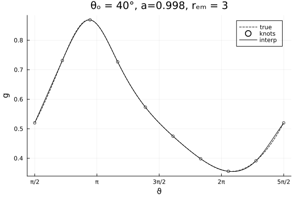
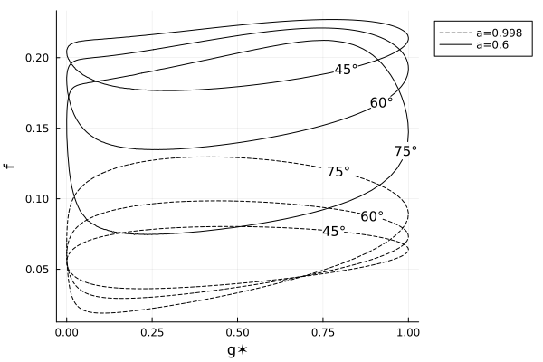
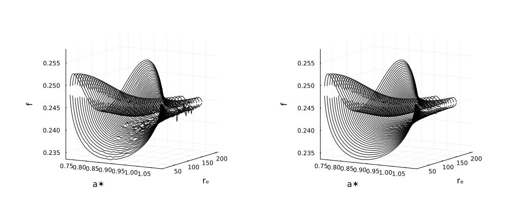

@def title = "Getting to grips with relativistic transfer functions"
@def date = Date(2022, 11, 11)
@def tags = ["2021", "julia", "relativity"]

# {{fill title}}

\tableofcontents


## Theory

A unit of flux $\d F$ measured by an observer in an infinitesimal solid angle on their sky $\d \Omega$, and may be related to the observed intensity $I$ at energy $E_\text{obs}$ by

\begin{equation}
    \d F_\text{obs}(E_\text{obs}) = I_\text{obs}(E_\text{obs}) \d \Omega.
\end{equation}

From MTW (1973), the observed and emitted intensities scales only with relative redshift $g$,

\begin{equation}
    I_\text{obs}(E_\text{obs}) = g^3 I_\text{em} (E_\text{em}),
\end{equation}

which itself is a consequence of Liouville's theorem: the number density of photons in phase space is conserved. The observed flux, expressed in terms of quantities known by the emitter, is then


\begin{equation}
    \d F_\text{obs}(E_\text{obs}) = g^3 I_\text{em}(E_\text{em}) \d \Omega.
\end{equation}

Integrating the RHS over the observer's sky presents practical limitations in sampling $I_\text{em}$ finely enough to reconstruct a good flux profile -- that is, for common accretion disc models, low and high energy flux contributions come from deep in the gravitational potential well, near the ISCO, where the velocities of inflowing matter are largest. This region only subtends a small angle in the observers sky relative to the extent of the full accretion disc, and therefore ray-tracing methods need to bias sampling this region.

### Change of variables

Quantities calculated by the method of ray-tracing are typically parameterised in terms of impact parameters on the observer's plane, $\alpha$ and $\beta$. Transforming between angular integration and a double integral over the impact parameters presents little problem, modulo factors of $\pi$ that are normalized away, however these parameters are typically layed out on regular grids. Obtaining high resolution images of the ISCO requires high resolution renders of the full disc, which are both time and memory hungry, and over-samples the outer disc. There are many ways in which this may be mitigated, but generally this method is slow and expensive.

Cunningham transformed this problem away by instead parameterizing the observer's sky in terms of redshifts emitted from specific radii on the disc, $r_\text{em}$. A bundle of photons emitted by a ring on the disc of radius $r_\text{em}$ give a set of redshifts, with an explicit and finite minima and maxima. Cunningham uses

\begin{equation}
    g^\ast := \frac{g - g_\text{min} }{g_\text{max} - g_\text{min} },
\end{equation}

to denote a given photon in this bundle, with $g^\ast \in [0,1]$. Note, however, that for all $g^\ast \notin \{0, 1\}$, there is a degeneracy that describes two photons, namely the photon with $g$ emitted by a point on the accretion disc moving away from the observer's line of sight, and another from the point moving towards the observer.

A full parameterisation of the sky may be constructed, since every photon observed emitted in the region of interest (the ISCO and outwards) may be associated with a $g^\ast$ in a bundle of photons coming from $r_\text{em}$. Using a change of variable substitution, the observed flux is

\begin{equation}
    \d F_\text{obs}(E_\text{obs}) = g^3 I_\text{em}(E_\text{em})
        \left\lvert \frac{\partial(\alpha, \beta)}{\partial(r_\text{em}, g^\ast)}  \right\rvert \d r_\text{em} \d g^\ast,
\end{equation}

where the partial differential term is a Jacobian.

### (Cunningham) Transfer functions

(Cunningham) Transfer functions were originally defined in Cunningham's paper, however the precise quoting by subsequent authors drop a normalizing term. Cunningham justifies the original definition

> This form of $f$ has been chosen so that its numerical value is nearly independent of $g^\ast$ and $r_\text{e}$.

This is presumably to solve numerical issues.

The transfer function methods have been popularized by a number of authors in computational astrophysics, specifically Dauser et al. (2010), in which a Green's function formulation espoused additional convenience. For that reason, I use the definition presented in Dauser et al. (2010),

\begin{equation}
    \label{eq:tf}
    f := \frac{g}{\pi r_\text{em}} \sqrt{g^\ast (1 - g^\ast)} \left\lvert \frac{\partial(\alpha, \beta)}{\partial(r_\text{em}, g^\ast)}  \right\rvert,
\end{equation}

and 

\begin{equation}
    \d F_\text{obs}(E_\text{obs}) = g^2 I_\text{em}(E_\text{em})
        \frac{\pi r_\text{em}f\left( r_\text{em}, g^\ast \right)}{\sqrt{g^\ast (1 - g^\ast)} } 
        \d r_\text{em} \d g^\ast.
\end{equation}

Note that $f$, like $g^\ast$, is double-valued except for extremal redshifts coming from $r_\text{em}$. Integrating over the appropriate limits

\begin{equation}
    \label{eq:integration}
    F_\text{obs}(E_\text{obs}) =  \int_{r_\text{in} }^{r_\text{out} } \int_{0}^{1} g^2 I_\text{em}(E_\text{em})
        \frac{\pi r_\text{em}f\left( r_\text{em}, g^\ast \right)}{\sqrt{g^\ast (1 - g^\ast)} } 
        \d g^\ast \, \d r_\text{em},
\end{equation}

presents a number of computational problems, both in determining $f$, and in avoiding singular values as $g^\ast \rightarrow 0, 1$ where the Jacobian diverges.

## Computation

Throughout this section, we will assume a geometrically thin disc in the equatorial plane. The methods are trivially generalizable to other geometries by projecting all radial components of the disc into the equatorial plane.

Let us begin by discussing methods for calculating the transfer functions. The first step is calculating the $(r_\text{em}, g^\ast)$ parameterization. An algorithm may be as follows:

@@theorem
For a target emission radius $r_\text{em}$, assume the circular ring on the disc may be projected as a _star-shaped_ ring on the image plane, given by pairs of $(\alpha, \beta)$. Since this region is star shaped, one may express

\begin{equation}
    \alpha = \xi \cos \vartheta, \qquad
    \beta = \xi \sin \vartheta,
\end{equation}

and find $\xi$ for a given $\vartheta$ for which the geodesic intersects the disc at radius $r_\text{em}$. The set of $\{(\xi, \vartheta)\}$ give $\{(\alpha, \beta)\}$ which may be used to determine the set of $\{g\}$ corresponding to the chosen emission radius, from which $g_\text{min}$, $g_\text{max}$ are found, and used to construct the $g^\ast$ parameter.
@@

The computational difficulty of this algorithm is in accurately determining $\xi$, and sampling enough $(\xi, \vartheta)$ to have a good estimate of $g_\text{min}$, $g_\text{max}$.

This problem is simple to solve when rephrased as a root finding problem:

```julia
function find_ξ_for_rₑ(metric, u, disc, rₑ, ϑ)
    # define a map ξ → (rₑ - r) on the disc
    𝔉 = ξ -> begin
        α = ξ * cos(ϑ)
        β = ξ * sin(ϑ)
        point = integrate_single_geodesic(metric, u, disc, α, β)
        r = point.u2[2]
        rₑ - r
    end
    # solve with Order0 : https://juliamath.github.io/Roots.jl/dev/reference/#Roots.Order0 
    ξ_sol = Roots.find_zero(𝔉, 2rₑ + 20.0)
    return ξ_sol
end
```

Note that the measure to find the root of is $(r_\text{em} - r)$ and not, for example, the other way around. This is done as photons hitting the event horizon have increasing $r$, when their projection into the disc is decreasing. Subtracting $(r - r_\text{em})$ might therefore present two unique roots for small $r_\text{em}$, which is undesirable, or at the very least prevent the bracketing limits from having opposite signs.

The choice of initial value here is arbitrary to scale with emission radius. A more informed prior on this will improve the performance of the algorithm.

Accurately estimating the extrema of $g$ may be achieved similarly, using the resulting $\xi$ to determine $g$, and then pass this function to a non-linear solver to determine which $\vartheta$ map to extremal $g$. The only problem here is that each step of the non-linear solver must root-find, which quickly becomes a costly problem.

Other authors (Bambi et al. (2017) and Abdikamalov et al. (2020)) use a coarse version of this to effectively binary search for the minima and maxima close to $\vartheta = 0, \pi$. Our method is to use a cubic spline interpolation over the $(\vartheta, g)$ calculated in the previous step, and then root-find over the derivative of the interpolation. This is both fast and surprisingly accurate in Julia, due to automatic-differentiation-enabled interpolations libraries like [PumasAI/DataInterpolations.jl](https://github.com/PumasAI/DataInterpolations.jl), and automatic-differentiation backends like [JuliaDiff/ForwardDiff.jl](https://github.com/JuliaDiff/ForwardDiff.jl).

We _apriori_ know that the minima and maxima of $g(\vartheta)$ will be close to $\vartheta=0,\pi$, however the domain of $\vartheta$ puts the minima and maxima at the edges of the domain, which may be difficult to optimize. We shift the domain of $\vartheta$ to $[\pi/2, 5\pi/2)$, such that the minima and maxima are close to $\pi$ and $2\pi$ respectively, in the middle of our domain.



With as few as 10 knots, the cubic interpolation already achieves a good estimate of the extrema. In practice, we use a minimum of 20 knots. These are currently always equally spaced, however different sampling methods may be explored in the future.


The code used to find the maximum and minimum is
```julia
∂(f) = x -> ForwardDiff.derivative(f, x)
function interpolate_extremal(y, x, x0)
    interp = DataInterpolations.CubicSpline(y, x)
    x̄ = Roots.find_zero(∂(interp), x0)
    x̄, interp(x̄)
end
```
which makes use of an initial guess `x0`, i.e. $\pi$ or $2\pi$.

@@todo
figure showing how error scales with number of knots
@@

Bambi et al. (2017) describe a method for determining the Jacobian calculations involved in $f$, and were kind enough to send me their code to examine when mine was failing. Their method makes use of

\begin{equation}
    \left\lvert \frac{\partial(\alpha, \beta)}{\partial(r_\text{em}, g^\ast)}  \right\rvert = \text{abs} \left(
        \frac{\partial g^\ast}{\partial \alpha}
        \frac{\partial r_\text{em} }{\partial \beta}
        -
        \frac{\partial g^\ast}{\partial \beta}
        \frac{\partial r_\text{em} }{\partial \alpha}
    \right) ^{-1},
\end{equation}

and calculate the differential terms by offsetting $\alpha \pm \epsilon$ and $\beta \pm \epsilon$, and numerically calculating the gradient at those points using effectively a 1$^\text{st}$ order finite differencing method.

Any finite differencing stencil may be applied to some central $\alpha$, and this is something we have exploited with help of [JuliaDiff/FiniteDifferences.jl](https://github.com/JuliaDiff/FiniteDifferences.jl):

```julia
function jacobian_∂αβ∂rg(metric, u, disc, α, β; diff_order = 5)
    # map impact parameters to r, g
    𝔉 = ((α_, β_),) -> begin
        point = tracegeodesic(metric, u, disc, α_, β_)
        g = redshift(metric, point)
        # return r and g
        @SVector [point.u2[2], g]
    end

    cfdm = FiniteDifferences.central_fdm(diff_order, 1)
    J = FiniteDifferences.jacobian(cfdm, 𝔉, @SVector([α, β])) |> first
    abs(inv(det(J)))
end
```

This calculates the Jacobian with respect to $g$ and _not_ $g^\ast$, purely for an optimization reason. In our code it is cheaper (from a memory + compute perspective) to defer calculating $g_\text{min}$ and $g_\text{max}$ until after all of the $g$ and $J$ had been calculated for a given $r_\text{em}$, as then $\alpha$ and $\beta$ could be discarded. The Jacobian is then rescaled correctly with

\begin{equation}
\left\lvert \frac{\partial(\alpha, \beta)}{\partial(r_\text{em}, g^\ast)}  \right\rvert
= (g_\text{max} - g_\text{min})
\left\lvert \frac{\partial(\alpha, \beta)}{\partial(r_\text{em}, g)}  \right\rvert.
\end{equation}

We then have all of the components to calculate the transfer functions $f$ as defined in eq. \eqref{eq:tf}. Below are a number of transfer functions for $r_\text{em} = r_\text{isco}$ for different viewer inclinations, as labelled in the curves, and two different spins.



The magnitude of the transfer functions changes dramatically for different viewing angles and spins at $r_\text{isco}$, since both of these changes alter the projected velocity of the accretion disc: changing the viewing angle changes the component of the velocity parallel to the line of sight, and changing the spin both alters the radius of the ISCO and the photon momentum. In the above figures, this is enough to reorder the ISCO transfer function contributions of different viewing angles.

## Integration

Dauser et al. (2010) introduces a Green's function formalism with the substitution 

\begin{equation}
I_\text{em}(E_\text{em}) = \delta(E_\text{em} - E_\text{s}) \varepsilon(r_\text{em}),
\end{equation}

equating the source emission to a delta function at a specific energy $E_\text{s}$. For convenience, use that

\begin{equation}
E_\text{em}(g) = g E_\text{s}, 
\end{equation}

for the given specific energy $E_\text{s}$, and then substitute into the flux integrand and evaluate the delta by integrating over $g^\ast$. I had to remind myself that delta functions have the property

\begin{equation}
\delta \left( f(x) \right) = \sum_{i} \left\lvert f\prime(x_i) \right\rvert^{-1} \delta (x - x_i),
\end{equation}

and so we gain a factor $1/E$ in the integrand, but without loss of generality one can set $E=1$. We also perform variable substitution $g^\ast \rightarrow g$ and pick up corresponding factors:

\begin{equation}
F_\text{obs}(g)
    =  \int_{r_\text{in} }^{r_\text{out} } \frac{g^3 \varepsilon(r_\text{em})}{(g_\text{max} - g_\text{min})}
        \frac{\pi r_\text{em}f\left( r_\text{em}, g^\ast \right)}{\sqrt{g^\ast (1 - g^\ast)} } 
        \d r_\text{em}.
\end{equation}

Since we want to find the flux at different energies, we split the integral into discrete bins of $E_\text{obs} + \delta E_\text{obs}$, which is equivalent to $g + \delta g$:

\begin{equation}
    F_\text{obs}(E_\text{obs} + \delta E_\text{obs})
    \rightarrow
    F_\text{obs}(g + \delta g)
    =  \int_{r_\text{in} }^{r_\text{out} } \pi r_\text{em} \varepsilon(r_\text{em})
        \int_{g}^{g+\delta g}
        \frac{g^3 f\left( r_\text{em}, g^\ast \right)}{(g_\text{max} - g_\text{min}) \sqrt{g^\ast (1 - g^\ast)} } 
        \d g \, \d r_\text{em}.
\end{equation}

Continuing with this integral notation quickly becomes cumbersome, so lets start digging into the details and walk through them step-by-step. Principally, there are three problems to address

1. Handling the double-valued nature of $f$ by splitting the integral into two branches.
1. Faithfully interpolating the transfer functions over $r_\text{em}$ and $g^\ast$.
2. Avoiding singular values of $f$ at $g^\ast \rightarrow 0, 1$ when integrating.

The first point requires separating the transfer function in continuous domains of $g^\ast \in (0, 1)$ by splitting the transfer functions at the points where $g^\ast = 0$ and $g^\ast = 1$. There are a number of possible ways to do this, but our approach is to group the knots into an _upper_ and _lower_ branch, and then interpolate each over $g^\ast$. This has the drawback that points close to $g^\ast \rightarrow 0,1 $ are required for the interpolation to be faithful, but $N\geq20$ knots seems to be sufficient. In the context of the integral, we split $f = f_\text{lower} + f_\text{upper}$ and integrate as normal.

The second and third point may be addressed in the context of each other.

### Avoiding singularities when integrating

Integrating the transfer functions according to eq. \eqref{eq:integration} is non-trivial. Bambi et al. (2017) and Dauser et al. (2010) describe integrating with respect to $\d g^\ast$ first, and then over $\d r_\text{em}$. The temptation is then to interpolate $f(r_\text{em}, g^\ast)$ over $g^\ast$ first, and marginalize the integral. However we, like Dauser et al. (2010), approach this the other way round. The motivation for this comes purely from numerical stability -- the integration algorithms seemed to converge faster when approached this way. 

The breadth and depth of numerical integration is beyond this post, but our method makes use of a interval based integration method (trapezoidal integration), and an adaptive Gauss-Kronrod quadrature scheme, as these methods harmonize well with the interpolation regimes. Gauss-Kronrod additionally has the benefit that over an interval $a, b$, the integrand is _never_ evaluated directly at $a$ or $b$, allowing us to avoid the singularities in $f$ at extremal $g^\ast$. The requirement that the integrand be smooth is also accounted for in our cubic spline interpolation.

Dauser et al. (2010) handle the divergent points by examining the limits fo the transfer functions

\begin{equation}
    \lim_{g^\ast\rightarrow 0} f(g^\ast) \propto \sqrt{1 - g^\ast}, \qquad
    \lim_{g^\ast\rightarrow 1} f(g^\ast) \propto \sqrt{g^\ast},
\end{equation}

concluding that the integrand diverges as $1/\sqrt{x}$, and that by assuming $g = \text{const}$ over the small integration interval, the analytic solution goes as

\begin{equation}
\lim_{g^\ast\rightarrow 0, (1-h)} F_\text{obs}(g + \delta g) \propto \sqrt{g + \delta g} - \sqrt{g}.
\end{equation}

They qualify this by $\delta g < h$, and use this approximation in the regions of $g^\ast \in [0,h]$ and $[1-h, 1]$, where the normalizing factors are determined from $F_\text{obs}(h + \delta g)$ and $F_\text{obs}((1-h) - \delta g)$.

In practice, the diverging region is finite and also related to unstable Jacobian values, and consequently $h$, even using Gauss-Kronrod integration, cannot vanish. Dauser et al. (2010) use $h = 5 \times 10^{-3}$ for their approximation, using Romberg adaptive trapezoid integration method for $g^\ast \in [h, 1-h]$. Our method can set $h \approx 10^{-9}$, and ignore the divergent region entirely, however we chose to keep the approximation until we have had a chance to explore the errors more in depth.

### Implementation

Trapezoidal integration evaluates the integrand at discrete locations, and then uses a weighted sum to calculate the integral. This permits lazy evaluation, where the weight $w$ may be calculated prior to the function, and the same weight used for any function over the same interval. 

Let me illustrate all of this better with a code snippet:

```julia
function integrate_drdg✶(ε, transfer_functions, radii, g_grid; N=10)
    # pre-allocate output
    flux = zeros(Float64, length(g_grid))

    minrₑ, maxrₑ = extrema(radii)
    # create N knots of interpolation
    interp = interpolate_over_radii(transfer_functions, N)

    # build fine radial grid for trapezoidal integration
    fine_rₑ_grid = build_rₑ_grid(minrₑ, maxrₑ, 1000) |> collect
    @inbounds for (i, rₑ) in enumerate(fine_rₑ_grid)
        # wrap integrand
        integrand = wrap_interpolations(interp)

        # trapezoidal integration weight
        if i == 1
            Δrₑ = (fine_rₑ_grid[i+1]) - (rₑ)
        elseif i == lastindex(fine_rₑ_grid)
            Δrₑ = (rₑ) - (fine_rₑ_grid[i-1])
        else
            Δrₑ = (fine_rₑ_grid[i+1]) - (fine_rₑ_grid[i-1])
        end

        # all radial factors
        weight = Δrₑ * rₑ * ε(rₑ)

        # integrate each bin in the redshift grid
        for j in eachindex(@view(g_grid[1:end-1]))
            glo = g_grid[j]
            ghi = g_grid[j+1]
            flux[j] += integrate_bin(integrand, rₑ, glo, ghi) * weight
        end
    end
    return flux
end
```

A grid of $r_\text{em}$ is created for the trapezoidal integration, in this case with $1000$ intervals. The weight for each interval may be calculated once, and then used for each redshift interval $g + \delta g$ between `glo` and `ghi`, over which the transfer function interpolation is actually evaluated. 

All of the integrand terms applying to $f$ are brought in as closure during `wrap_interpolations`. The precise implementation is unimportant, and can be seen in the Gradus.jl code repository as mentioned.

The `interpolate_over_radii` function requires closer examination: so far, we have a discrete set of transfer functions separated into upper and lower branches, but now we wish to evaluate the transfer functions for arbitrary $r_\text{em}$, and therefore we interpolate $f$ over $r_\text{em}$ linearly for $N$ different values of $g^\ast$  -- the knots.

@@todo
figure
@@

Then `integrate_bin` uses the interpolations to evaluate the integrand. Keeping with Dauser et al (2010), we handle the divergent region separately:

```julia
function integrate_bin(integrand, rₑ, lo, hi; h = 2e-8)
    gmin = integrand.gmin(rₑ)
    gmax = integrand.gmax(rₑ)

    # ensure we don't go out of bounds
    glo = clamp(lo, gmin, gmax)
    ghi = clamp(hi, gmin, gmax)

    intensity = 0.0
    # no bin width, i.e. out of limits for this transfer function
    if glo == ghi
        return intensity 
    end

    g✶lo = g_to_g✶(glo, gmin, gmax)
    g✶hi = g_to_g✶(ghi, gmin, gmax)

    if (g✶lo < h) || (g✶hi > 1-h)
        # ... handle edge integration ...
    end

    res, _ = QuadGK.quadgk(integrand, glo, ghi)
    intensity += res
    return intensity 
end
```

The bulk of the work is performed here by [JuliaMath/QuadGK.jl](https://github.com/JuliaMath/QuadGK.jl).

For posterity, I want to note here that my initial implementation had the transfer function interpolations mapping $g^\ast \mapsto f(g^\ast)$, and integrating over $[g^\ast(g),g^\ast(g + \delta g)]$. I spent many weeks debugging this implementation, before realizing that I had implicitly performed a change of variable in the integrand, and was missing a factor $\lvert \partial g^\ast / \partial g \rvert$. The current implementation of the code uses interpolations that map $g \mapsto f(g^\ast(g))$ to mitigate this.

### Normalizing approximating regions

The normalizing factor for the "edge" region of the $\d g$ integration is a little more complex in practice than just using scaling values of $F_\text{obs}$ as described in Dauser et al. (2010). Indeed, their Fortran code does something a little more akin to:

```julia
function integrate_edge(integrand, h, lim, gmin, gmax, low::Bool)
    if low
        gh = g✶_to_g(h, gmin, gmax)
        a = √gh - √lim
    else
        gh = g✶_to_g(1 - h, gmin, gmax)
        a = √lim - √gh
    end
    2 * integrand(gh) * √h * a
end
```

The factor $2$ comes from integrating the diverging terms that go as $1/\sqrt{x}$, whereas $\sqrt{h}$ I know is related to the bin width, but am unsure of its motivation. Dauser et al. (2010) have an additional factor $(g_\text{max} - g_\text{min})$, which I assume is a Jacobian term, but including any of these factors actually seems to make my normalization _worse_ when $h$ is artificially increased.

## Algorithmic caveats

My implementation for calculating the transfer functions works well for $r_\text{em} < \sim 25 r_\text{g}$, but after this deviates from the Dauser et al. (2010) calculated table, and indeed even begins to produce increasingly large transfer function magnitudes for larger radii, where the colloquial _lower_ branch miraculously becomes the _upper_ branch. My understanding is that this issue related to how the redshift is calculated at large impact parameters $\alpha$, $\beta$, corresponding to wide fields of view. I had already noticed that assuming $p^\mu u_\mu = 1$ for the photon energy at the observer adds a vignetting error to the redshift, since observer radii of $\sim 1000 \, r_\text{g}$ is only a _rough_ approximation of flat spacetime. Instead calculating $p^\mu u_\mu$ at the observer gives energies slighty different from $1$, approximately 1 part in 100 if I remember correctly.

This _should_ then be resolved in two ways: either use the proper observer energy calculations, or simply move the observer back, scaling with $r_\text{em}$, keeping $\alpha$, $\beta$ small. I've opted for the latter, to keep the redshift equations consistent with those in Cunningham and Fabian et al. (1997). I will investigate the source of this deviation further at a later date.

~~~
<p>
</img>
</p>
~~~

Left panel does _not_ move the observer back as a function of $r_\text{em}$, whereas the right panel does.

Another caveat is in the finite difference stencil -- depending on the sensitivity in the transfer function Jacobian at high $r_\text{em}$ or $a < \sim 0.8$, these methods sometimes require higher or lower orders, and there's no single value which works well for all cases, and also needs to be adjusted a little. Using a different algorithm (central vs forward, etc.) _could_ help here, but I am tempted instead to use automatic-differentiation, since the DifferentialEquations.jl solver support dual number types. This is something that will likely change in my implementation in the future, however for now we just dynamically change the stencil order.

For example, using a finite stencil of order $4$ is too coarse at large emission radii, where the differences in redshifts over an emission ring can be very small with $\Delta g = g_\text{max} - g_\text{min} \approx 0.09$ at $r_\text{em} = 200$, versus $\Delta g \approx 0.5$ at $r_\text{em} = 4$ for $a=0.998$. This is reflected in numerical noise in the calculated transfer functions:

~~~
<p>
</img>
</p>
~~~

Left panel is central finite difference stencil with order $4$, right panel is order $5$.

Since most emissivity models for $\varepsilon$ assume some $r^{-\alpha}$ dependence, the terms at large radii are suppressed, and the noise in the functions is less important. I believe it is still worth mentioning, to illustrate how fiddly these calculations can be.