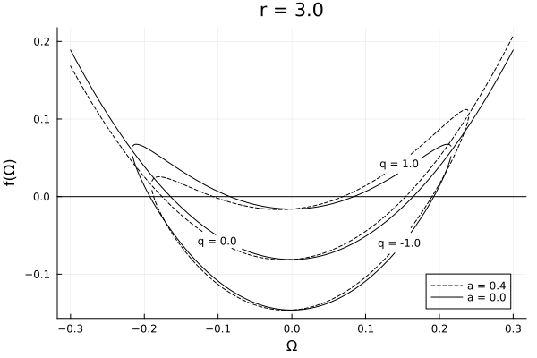
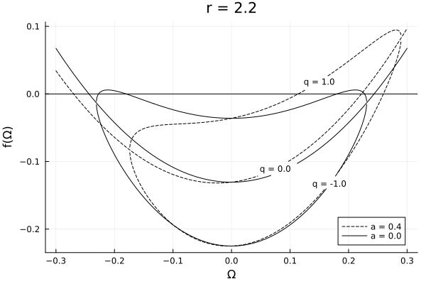
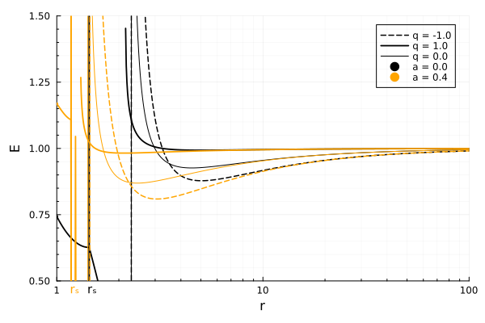
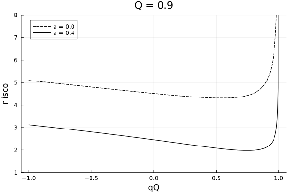

@def title = "Circular orbits of charged particles"
@def date = Date(2023, 03, 05)
@def tags = ["2023", "julia", "relativity"]

# {{fill title}}

In the last couple of days I've been trying to add the [Kerr-Newman](https://en.wikipedia.org/wiki/Kerr%E2%80%93Newman_metric) metric to [Gradus.jl](https://github.com/astro-group-bristol/Gradus.jl). The Kerr-Newman metric describes a black hole spacetime, with mass $M$, spin $a$, and charge $Q$. The metric may be expressed in Boyer-Lindquist coordinates as

$$
\d s^2 = 
    -\frac{\Delta - a^2 + \sin^2 \theta}{\Sigma}  \d t^2 
    + \frac{\Sigma}{\Delta} \d r^2 
    + \Sigma \d \theta^2 
    + \frac{\sin^2 \theta}{\Sigma} \left[\left(r^2 + a^2\right)^2 - a^2 \Delta \sin^2 \theta \right] \d \phi^2 
    - 2 \frac{a \sin^2 \theta}{\Sigma} \left(r^2 + a^2 - \Delta \right)  \d t \d \phi,
$$

where 

$$
\Sigma = r^2 + a^2 \cos^2 \theta, \quad \text{and} \quad \Delta = r^2 - 2 M r + a^2 + Q^2.
$$


Implementing the metric itself is straight forward, and now a new class of geodesic may be traced: those with non-zero charge per unit mass $q$, which therefore interact electromagnetically with the central singularity.

These have been studied in a number of papers, for example [Schroven, Hackmann and Lämmerzahl (2017)](#fndef:kris)[^kris], which studies in detail the innermost stable circular orbit (ISCO) for different charge configuration, and the effect this has on accreting matter of negative (electrons) and positive charge (protons/ions). There is also the earlier paper by [Hackmann and Xu (2013)](#fndef:hackmann)[^hackmann], which explores more generally the orbits of charged particles in the Kerr-Newman spacetime and classifies them into a number of classes to describe their behaviour. These works, and references therein, use the Hamilton-Jacobi formalism to calculate an effective potential on the four-velocity components, and use this to infer stable (circular) orbits and the ISCO. I would instead like to study this from a step back, directly from the 2nd order geodesic equation, with an Ansatz for the Lorentz force

$$
\label{eq:geod}
\frac{\d^2}{\d \lambda^2} x^\mu = - \tensor{\Gamma}{\mu}{\alpha\beta} \dot{x}^\alpha \dot{x}^\beta + q \tensor{F}{\mu}{\alpha} \dot{x}^\alpha,
$$

where $\tensor{F}{\mu}{\alpha}$ is the Faraday tensor, and the dot denotes differentiation with respect to affine time $\lambda$. This second-order ordinary differential equation may be solved with some initial position $x^\mu$ and 3-velocity $\vec{\dot{x}}$, as $\dot{x}^t$ is constrained via

$$
\label{eq:constraint}
g_{\alpha \beta} \dot{x}^\alpha \dot{x}^\beta = -\mu^2
$$

where $\mu$ is the invariant mass.

In this post, I would like to study the class of circular charged orbits in the equatorial plane, beginning from eq. \eqref{eq:geod}, to determine semi-analytic solutions for the angular momentum and energy of these orbits.

## Faraday tensor

The Faraday tensor for our purposes will be defined from the four-potential

$$
A_\mu = \frac{Q r}{\Sigma} \left(1 \d t - a \sin^2 \theta \d \phi \right),
$$

such that the Faraday tensor is

$$
F_{\mu\nu} = \partial_\mu A_\nu - \partial_\nu A_\mu.
$$

This means there are only 4 unique non-zero components of the anti-symmetric tensor, namely $F_{rt}, F_{\theta t}, F_{r\phi}, F_{r\theta}$, with the other 4 being their anti-symmetric counterparts.

It is worth noting that with this potential, one must only consider the product of the particle and black hole charge $qQ$ in the equations of motion, since there are no terms that depend only on $q$ or $Q$. There are therefore 2 classes of solution we can expect depending on the sign of $qQ$. Similarly in the metric, only terms with $Q^2$ appear and consequently the parity is also lost. We therefore restrict ourselves to $Q \geq 0$ and allowing $q$ to take both negative and positive values to study all solution classes.

## Keplerian angular velocity


Following the method of [my previous blog post](../2022.05.09.plunging-photons), we will rework eq. \eqref{eq:geod} in the equatorial plane, subject to $\dot{x}^r = \dot{x}^\theta = 0$, and calculate the Keplerian angular velocity, defined

$$
\Omega_\phi := \frac{\dot{x}^\phi}{\dot{x}^t}.
$$

The energy and angular momentum already have known solutions in terms of $\Omega_\phi$ and metric terms. After expanding the Christoffel symbols and working through a little algebra (as in the previous post), one obtains

$$
0 = \frac{1}{2}\left( \frac{\partial}{\partial r} g_{tt} (\dot{x}^t)^2
    + 2 \frac{\partial}{\partial r} g_{t\phi} \, \dot{x}^t \dot{x}^\phi
    +\frac{\partial}{\partial r} g_{\phi \phi} (\dot{x}^\phi)^2 \right)
    + q g_{rr} \left(\tensor{F}{r}{t} \dot{x}^t + \tensor{F}{r}{\phi} \dot{x}^\phi \right),
$$

and dividing by $(\dot{x}^t)^2$, one obtains

$$
\label{eq:expanded_geod}
0 = \frac{1}{2}\left( \frac{\partial}{\partial r} g_{tt}
    + 2 \frac{\partial}{\partial r} g_{t\phi} \Omega_\phi
    +\frac{\partial}{\partial r} g_{\phi \phi} \Omega_\phi^2 \right)
    + q \frac{g_{rr}}{\dot{x}^t} \left(\tensor{F}{r}{t} + \tensor{F}{r}{\phi} \Omega_\phi \right),
$$

which bears a factor $1/\dot{x}^t$ on the charge terms. The first term in this equation is a simple quadratic, but with these charge terms added, we require some way of eliminating or determining $\dot{x}^t$ in order to solve for $\Omega_\phi$.

The only thing I can think to do here is to use eq. \eqref{eq:constraint}, and writing

$$
\label{eq:ut}
\frac{1}{\dot{x}^t} = \frac{1}{\mu} \sqrt{- \left(g_{tt} + 2g_{t\phi} \Omega_\phi + g_{\phi \phi} \Omega_t^2 \right)}.
$$

One could then balance eq. \eqref{eq:expanded_geod} to have one term either side of the equals sign, substitute the $1/\dot{x}^t$, and square to obtain a quartic equation. Doing so also loses information about the sign of $q$, but that is something we could add in later. Although this is in theory then analytically solvable, in reality the expression is horrendous, and I cannot find a nice simple way of reducing the quartic into e.g. the product of two quadratics, or a depressing it to simplify the expression. There are no doubt other ways to tackle such an equation, but I am not versed in polynomial analysis and would have a hard time approaching the problem.

For now, I'd instead prefer a semi-analytic approach, and use a root finder to solve for the solutions. Since the overall form of the equation is leading order quadratic, and we can _a priori_ select $\dot{x}^t$ that goes forwards in time, we may therefore anticipate classes of solutions for $\Omega_\phi$, corresponding to the prograde and retrograde orbits.

Implementing a short Julia function:

```julia
using Gradus

function functor_Ω(
    m::KerrNewmanMetric,
    rθ;
    q = 0.0,
    μ = 1.0
)
    g, jacs = Gradus.metric_jacobian(m, rθ)
    # only want the derivatives w.r.t. r
    ∂rg = jacs[:, 1]

    x = SVector(0, rθ[1], rθ[2], 0)
    F = Gradus.maxwell_tensor(m, x)

    function f(ω)
        Δ = (ω^2 * ∂rg[4] + 2 * ω * ∂rg[5] + ∂rg[1])
        arg = -(ω^2 * g[4] + 2 * ω * g[5] + g[1]) / μ^2
        # check to ensure we can preserve forwards-in-time
        ut = if arg >= 0
            sqrt(arg)
        else
            # return something distinct
            return NaN
        end
        # combine with charge terms
        0.5 * Δ + (F[2, 4] * ω + F[2, 1]) * g[2] * q * ut
    end
end
```

This function limits the domain of $\Omega_\phi$ to solutions with $\frac{1}{u^t} \geq 0$. We then set up some initial configuration:

```julia
m = KerrNewmanMetric(M = 1.0, a = 0.0, Q = 0.9)
rθ = SVector(3.0, π/2)
```

I'd like to note that this picture is extremely unphysical. If a black hole _were to have charge_, it is likely that the charge is vanishingly small in the metric[^kris], and that the charge product $qQ$ is instead non-zero. But there is nothing in the mathematics that prevents us from exploring this class of spacetimes, so we will press on.

Plotting the value of the constraint equation for different $\Omega_\phi$ for two different spins:



Discontinuities are due to limited resolution ($N_{\Omega_\phi}=300$). The two solutions, prograde and retrograde, are clearly defined. When $|q| > 0.0$, the possible range of $\Omega_\phi$ is limited by the positivity constraint in eq. \eqref{eq:ut}. 
- For the Schwarzschild case $a=0.0$, the function is symmetric about the central axis. The roots differ only by parity, $\Omega_{\phi,1} = - \Omega_{\phi, 2}$, for both the charged and uncharged orbits. We identify the effect of charge is to either increase ($q=-1$) or decrease ($q=1$) the angular velocity relative to the uncharged case.
- For the spinning case $a = 0.4$, the function is skewed and loses its symmetry, but the effects of charge remain the same.

We can clearly identify the values of $\Omega_\phi$ corresponding to each of the $q = \{-1, 0, 1\}$ cases. Ambiguity is introduced if we move closer:



Examining the two cases again:
- There are still four solutions to the charged particle orbits in the Schwarzschild case, but only if one considers the $q = \pm 1$ curves to be continuous. Else we must conclude that there are four possible orbits for $q=1$ and none for $q = -1$ at the same radius, which we can rule out, as circular orbits _must_ have a unique $\Omega_\phi$, modulus the direction (prograde or retrograde).
- For the spinning case, we identify only two real roots, corresponding to prograde orbits, both on the $q = 1$ branch. Again, we must consider the $q = \pm 1$ curves to be continuous to rationalize the roots. At this distance, retrograde circular orbits for the spinning case are impossible.

I am unsure what the interpretation here is: one could interpret that the direction of time has changed, as in eq. \eqref{eq:ut}, there is no difference between $q \rightarrow -q$ and $u^t \rightarrow -u^t$. Thus the transformation $(q, u^t) \rightarrow (q, -u^t)$ is equivalent to the $(-q, u^t)$ case, which puts negative charge orbits on the curve corresponding to positive charge orbits when the direction of time is changed.

We can analytically continue the curves to represent this with the modification to our function:
```julia
ut = sign(arg) * sqrt(abs(arg))
```


I have coloured the line corresponding to $q = 1$ for $a = 0.4$ orange to emphasize how the continuation is realized. I have chosen to adopt this in the Gradus.jl implementation. It also helps with the root finder for $\Omega_\phi$ to have the function defined all along the domain (~;

## Energy and ISCO

Here we will use the [method outlined previously](posts/2022.05.09.plunging-photons/#determining_the_isco) for determining the ISCO, using the same minima finding method in the energy expression. We must note however that the energy and angular momentum are from the canonical four-momenta, which is modified under the influence of the electromagnetic potential as described in [Tursunov, Zdeněk, and Kološ (2016)](#fndef:tursovon)[^tursunov] for an external magnetic field, and [Carter (1968)](#fndef:carter)[^carter] for the general class of Kerr metrics.

Quickly re-deriving the canonical momenta from the Lagrangian

$$
\mathcal{L} = \frac{1}{2} g_{\mu\nu} \dot{x}^\mu \dot{x}^\nu - q A_\sigma \dot{x}^\sigma,
$$

with the momenta defined

$$
\pi_\nu := \frac{\partial \mathcal{L}}{\partial \dot{x}^\nu},
$$

and consequently

$$
\label{eq:canonical-momentum}
\pi_\nu = g_{\nu\mu}\dot{x}^\mu - q A_\nu = \dot{x}_\nu - q A_\nu.
$$

As a note, some authors define the electron charge as $q > 0$, including in the two papers I referenced that derive this. Hackmann and Xu (2013) use the convention I am adopting here and in Gradus.jl: the electron charge corresponds to $q < 0$. This is an important distinction, as it changes the sign in eq. \eqref{eq:canonical-momentum}. Note that this convention is only important here, since we see an isolated $q$ term. In the equations of motion from eq. \eqref{eq:geod}, we only see terms like $qQ$, where the relative signs are important.

We therefore identify as usual $E = -\pi_t$ and $L_z = \pi_\phi$ as constants of motion, and 

$$
\therefore \quad E = -(\dot{x}_t - q A_t), \quad \text{and} \quad L_z = (\dot{x}_\phi - q A_\phi).
$$


We find $\dot{x}_t$ and $\dot{x}_\phi$ using $\Omega_\phi$, as in the previous blog post, and can then plot the energy as a function of radius:



For the case of $q=1$, we have $E \approx 1$ for the majority of orbits. The _marginally bound_ orbit is defined as the circular orbit with $E = 1$, so although these orbits are stable, they are not very tightly bound relative to the other setups. This has implications for a maximal charge quotient $qQ$ for which circular orbits may be found.

For the case of $q = 1$, numerical limitations prevent fully describing the energetic system at small radii, as can be seen by blatant discontinuities in the curves, where the root finder has struggled to find solutions for $\Omega_\phi$.

We can find the ISCO by determining the minima of the energy of the circular orbits, i.e.

$$
\left.\frac{\partial E}{\partial r}\right\rvert_{r=r_\text{ISCO}} = 0.
$$

Plotting the ISCO as a function of charge product $qQ$:



At $qQ = 1$, both curves are divergent and $r_\text{ISCO} \rightarrow \infty$. For negative charge products the ISCO is increases -- this is equivalent to an additional attractive force, or an effective increase in gravitational potential, pulling on the particle. Orbits that were once stable are no longer, and hence $r_\text{ISCO}$ increases.

For positive charge products, the ISCO initially decreases, reaching a minima, before increasing rapidly. The initial decrease may be thought of as the repulsion holding up the orbit and weakening the gravitational potential, allowing previously unstable orbits to become stable. The subsequent increase is interpreted as the EM repulsion overpowering gravity, suppressing the gravitational term in eq. \eqref{eq:geod}.


## Orbit finding approach

[^kris]: Schroven, Kris, Eva Hackmann, and Claus Lämmerzahl. ‘Relativistic Dust Accretion of Charged Particles in Kerr-Newman Spacetime’. Physical Review D 96, no. 6 (26 September 2017): 063015. https://doi.org/10.1103/PhysRevD.96.063015.
[^hackmann]: Hackmann, Eva, and Hongxiao Xu. ‘Charged Particle Motion in Kerr-Newmann Space-Times’. Physical Review D 87, no. 12 (24 June 2013): 124030. https://doi.org/10.1103/PhysRevD.87.124030.
[^tursunov]: Tursunov, Arman, Zdeněk Stuchlík, and Martin Kološ. ‘Circular Orbits and Related Quasiharmonic Oscillatory Motion of Charged Particles around Weakly Magnetized Rotating Black Holes’. Physical Review D 93, no. 8 (7 April 2016): 084012. https://doi.org/10.1103/PhysRevD.93.084012.
[^carter]: B Carter (1968). _Global structure of the Kerr family of gravitational fields_. PHYS REV **174**:5.
