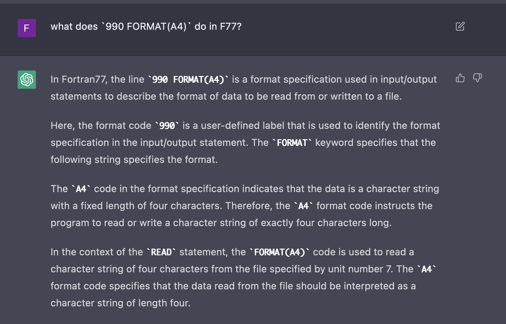

@def title = "Translating Fortran77 into a contemporary language"
@def date = Date(2023, 03, 30)
@def tags = ["2023", "fortran"]

# {{fill title}}

## Attempts at automatic conversion

I am awful at reading and writing Fortran code. I have absolutely no interest in learning it either. So my first idea was to try and use some automatic translators to bring it as close to something I like reading, like C, as quickly as possible.

I learned that the code is in Fortran 77 fixed-source format, so most of the tools I had available wouldn't work with it, as they work with Fortran 90. Searching on the internet, I found a tool which could translate the code automatically.

Unfortunately, the F90 version didn't compile, and other tools I tried using, such as fable, failed to translate it further. At least I could use `fprettify` to correct the indenting to make it comprehensible.

## Modularise the code

I tried to move as many subroutines as I could into new files, to make the code smaller. I wrote a little Makefile to help me with this

```make
BUILD_DIR := build
SRC_DIR := src
LDFLAGS := -L$(BUILD_DIR) -lreflionx
FC := gfortran
FFLAGS := -O2
LIB_TARGETS := recsum.o nspline.o illum.o lumin.o trislv.o adi.o chang.o arnaud.o primry.o gaunt.o ioneqm.o

LIB_BUILD_TARGETS := $(foreach t, $(LIB_TARGETS), $(BUILD_DIR)/$t)
EXE = $(BUILD_DIR)/bhreflect4

main: lib
	$(FC) $(SRC_DIR)/bhbreflect4.for -o $(EXE) $(LDFLAGS) $(FFLAGS)

lib: $(LIB_BUILD_TARGETS)
	$(FC) -shared $(LIB_BUILD_TARGETS) $(FFLAGS) -o $(BUILD_DIR)/libreflionx.so

$(BUILD_DIR)/%.o: $(SRC_DIR)/%.for
	@mkdir -p $(BUILD_DIR)
	$(FC) -fPIC $(FFLAGS) -c $< -o $@

test: main
	$(EXE) ./input_test.txt

.PHONY: clean
clean:
	rm -fr $(BUILD_DIR)
```

This compiles `LIB_TARGETS` given their `*.for` source code files, and then combines all the object files into a single shared library, which I link when compiling the main file `bhreflect4.for`. I then went through the process of grepping for `SUBROUTINE` and `FUNCTION` and moving those blocks into a new file, adding the object as a target, running make, seeing if it ran as before, and then either reverting or moving depending on that test.

Something I very quickly noticed is that omitting `-O2` from the build flags made the code non-deterministic. Evidently there is some out of bounds memory operation that the optimizer optimizes away. That's annoying because it means any debug symbols I generate will be less faithful to the code.

There were a number of subroutines that I could not move out, which unfortunately made up for the bulk of the program. After moving everything I could into a new file, the main source file was reduced from 2500 LOC to about 1900 LOC.

Fortunately, however, the subroutines I was able to pull out are all quite simple and self contained. So the next step is to see if I can rewrite one in a new language.

## Ziggy stardust

Although only certain subroutines worked when pulled out, I left all of the subroutines as their own files, so I could quickly open and examine them in isolation. I decided to pick one of the smallest by LOC to try translating a function into zig.

```bash
[cosroe: bhbreflect4] (linking-test) $ find src -type f -exec wc -l {} \; | sort
      17 src/arnaud.for
      21 src/ioneqm.for
      22 src/trislv.for
      29 src/chang.for
      32 src/cenlum.for
      45 src/illum.for
      47 src/gaunt.for
      48 src/lumin.for
      57 src/citfitfcn.for
      58 src/recsum.for
      61 src/adi.for
      76 src/primry.for
      83 src/setup.for
      85 src/binner.for
      92 src/sigmas.for
     139 src/getdata.for
     139 src/nspline.for
     397 src/inandout.for
     539 src/inoutdata.for
     763 src/structure.for
    1931 src/bhbreflect4.for
```

I picked `ioneqm.for`, as it turned out to be about 15 lines of zig, most of that converting pointers. I learned that F77 passes all arguments by pointer, and that strings additional carry a length parameter that is implicit in the subroutine, but must be explicitly provided in zig. More on this later.

The trial function then looks like this
```zig
export fn ioneqm_(zeta_ptr: *f64, alpha_ptr: *f64, frac0: *f64, frac_ptr: *f64, last: *i32) void {
    var zeta = @ptrCast([*]f64, zeta_ptr);
    var alpha = @ptrCast([*]f64, alpha_ptr);
    var frac = @ptrCast([*]f64, frac_ptr);
    var i = @intCast(usize, last.*);

    frac[i] = 1.0;
    while (i > 1) : (i -= 1) {
        frac[i - 1] = frac[i] * zeta[i] / alpha[i];
    }
    const total = frac[0] * zeta[0] / alpha[0];
    frac0.* = total;
    // reset and normalize
    i = 0;
    while (i < last.*) : (i += 1) {
        frac[i] = frac[i] / total;
    }
}
```
I deleted the F77 source and added a new target to my Makefile

```make
$(BUILD_DIR)/%.o: $(SRC_DIR)/%.zig
	@mkdir -p $(BUILD_DIR)
	zig build-obj -fPIC $< -femit-bin=$@
```

This all worked perfectly, no problems at all. No need to even declare an interface or use `EXTERNAL`.

## Patching to fragment

Now that I had a proof of concept for being able to link in a new function, I was ready to start translating those subroutines I had already been able to separate. This is a good start, but there are still ~2k LOC unaccounted for.

I wanted to split the functions up further. So to do that I needed to discover what was causing them to break. Using ChatGPT, I was able to query single lines of F77 I was too lazy to search for, e.g.:



Saves me a lot of documentation reading. I then wanted to start compiling with debug symbols `-g` and running the code in lldb to find where and what is going wrong.

I didn't have my lldb notes in the office at the time, so I meanwhile opted to compile in the sanitizer with `-fsanitize=address`. Unfortunately, it seems that the sanitizer for gfortran isn't available on my architecture (no `-lasan`), and `flang` cannot resolve `-lSystem`.

My new plan of attack then is to use `lldb`. I picked `getdata` as the function I would tackle first, since it is only called in one place and seems to only read file values into common data.

When I do that, I get the same error code generated as when it is part of the larger code. After brief inspection, I see it is because a variable called `MOST` is not initialized correctly. Annoyingly, grepping through the main file, I cannot see anywhere where it is assigned a value.
